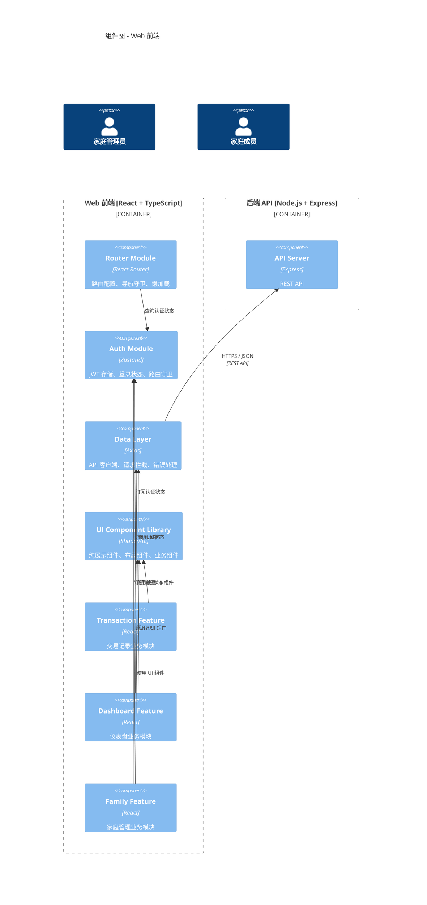
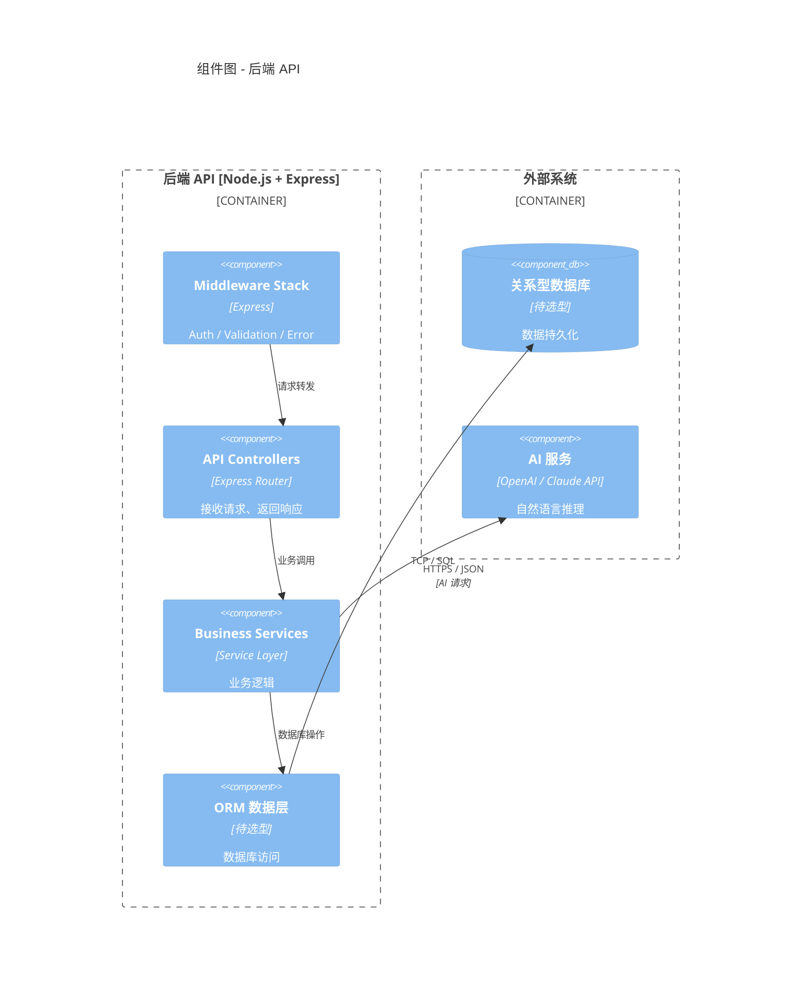
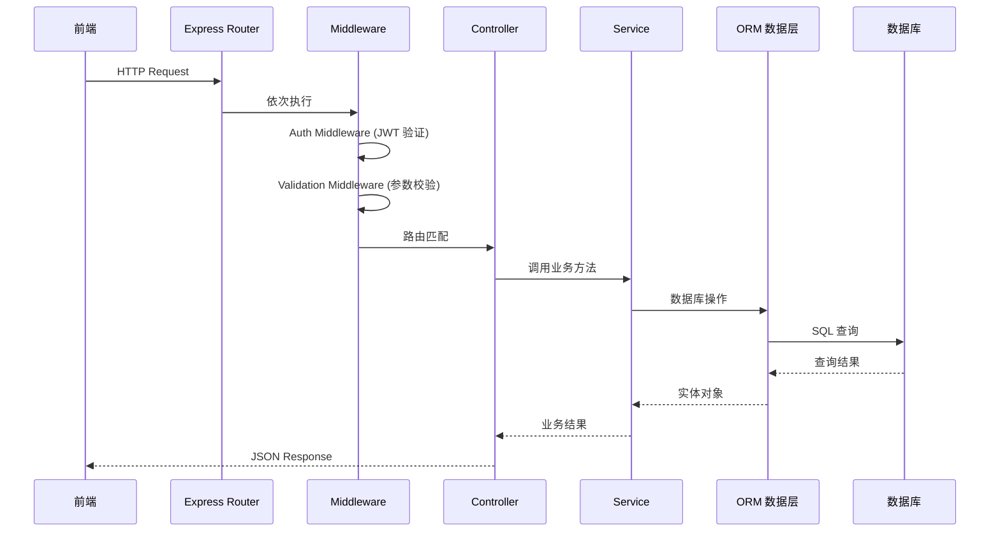
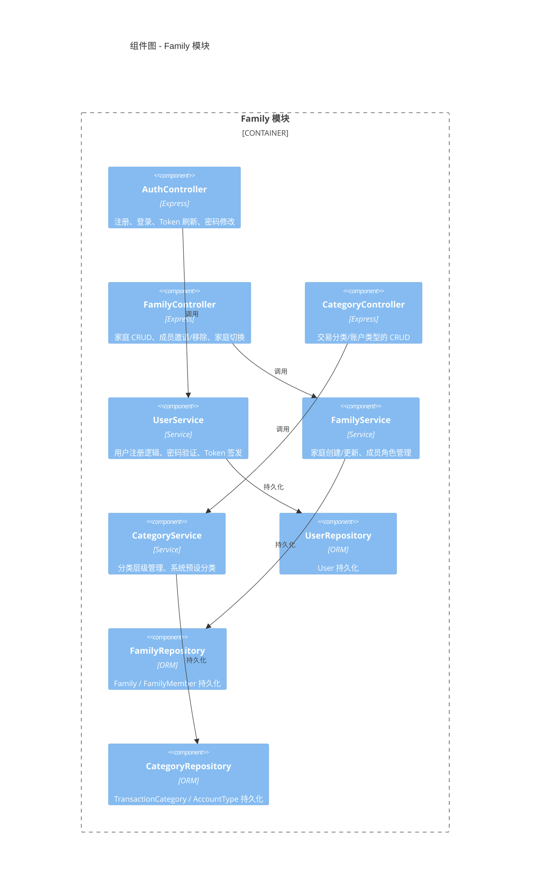
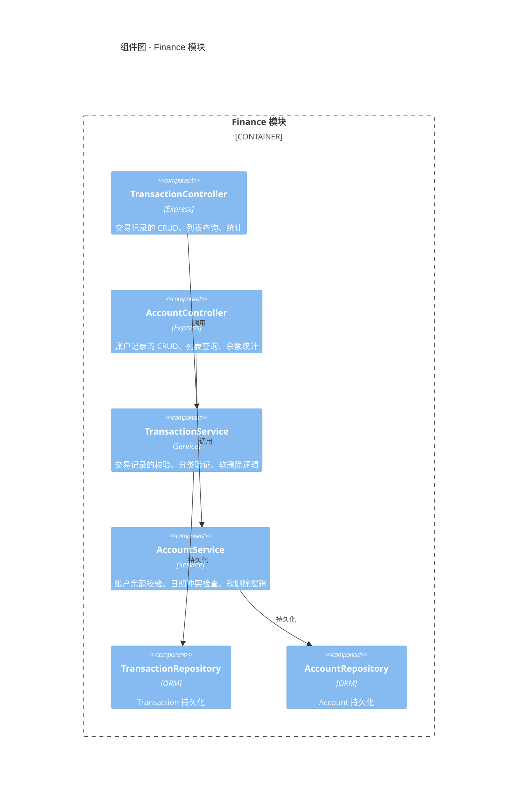

# l3-Component

本文档描述 FFP 系统各容器内部的组件分解，展示每个容器内有哪些代码级别的组件及其协作关系。

> Component 是容器内的一个代码模块（如 Controller、Service、Repository），通常由单个开发者或小组实现。
>
> **关联**：组件间的运行时协作（方法调用链、异步交互）见 [../dynamic/](../dynamic/)（C4 L4 Dynamic View）。

---

## 1 组件总览

| L2 容器 | L3 主要组件 |
|---------|------------|
| **Web 前端** | Pages、Feature Modules、Shared Components、API Client、State Management、Router |
| **后端 API** | Controllers、Services、Middleware、Security、ORM 数据层 |

---

## 2 Web 前端组件

### 2.1 组件图

> **浏览器 API 不作为外部系统**：LocalStorage、ServiceWorker 等浏览器 API 是前端组件的技术实现细节，属于 Web 前端容器的内部依赖，不在 L3 图中单独展示。

### 2.2 组件职责

| 组件 | 职责 | 接口 |
|------|------|------|
| **Router Module** | 路由配置、导航守卫（未登录跳转）、懒加载 | 路由表、`<Route />` 配置 |
| **Auth Module** | 用户认证状态管理、JWT 存储与刷新、登录/登出逻辑 | `useAuth()` Hook、认证守卫 |
| **Data Layer** | 统一 API 客户端、请求/响应拦截、错误处理、Token 注入 | `api.get/post/put/delete()` |
| **UI Component Library** | 纯展示组件（FormField、DataTable、FilterBar、EmptyState）、布局组件 | Props 驱动的 React 组件 |
| **Transaction Feature** | 交易记录业务模块：列表、表单、筛选、分类选择 | `TransactionList`、`TransactionForm` 等 |
| **Dashboard Feature** | 仪表盘业务模块：图表、关键指标、趋势分析 | `DashboardChart`、`SummaryCards` 等 |
| **Family Feature** | 家庭管理业务模块：成员管理、分类设置、账户设置 | `FamilySettings`、`CategoryManager` 等 |

### 2.3 组件依赖规则

| 规则 | 说明 |
|------|------|
| **Feature → Data Layer** | 业务模块通过 Data Layer 发起 API 调用，不直接访问 `axios` |
| **Feature → Auth Module** | 业务模块订阅认证状态，获取当前用户/家庭信息 |
| **Feature → UI Library** | 业务模块使用共享 UI 组件构建界面 |
| **Router → Auth Module** | 路由守卫查询认证状态，控制页面访问权限 |
| **Data Layer → Auth Module** | API 请求自动注入 Token，401 时触发登出 |
| **禁止循环依赖** | Feature 之间不直接依赖，共享逻辑提取到 Data Layer 或 UI Library |

> **组件粒度说明**：Feature 模块（Transaction Feature 等）是业务领域的组件集合，内部可包含多个页面和子组件。粒度较粗的设计是为了保持图的简洁性，详细分解见各 Feature 的 README 或组件树文档。

---

## 3 后端 API 组件

### 3.1 组件图

### 3.2 组件职责

| 组件 | 职责 |
|------|------|
| **Middleware** | 请求拦截（认证、参数校验、错误处理、日志） |
| **API Controllers** | 接收 HTTP 请求，调用 Service 处理，返回统一格式响应 |
| **Business Services** | 实现业务逻辑，操作实体，协调多个 Repository |
| **ORM 数据层** | ORM 单例管理、数据库连接、事务封装 |

> **Security**（JWT 服务、密码哈希）作为横切关注点，在第 5 节单独说明，不在主组件图中展示。

### 3.3 请求处理流程

---

## 4 业务模块组件分解

后端 API 按业务领域划分为两个模块：Family（用户/家庭/分类）和 Finance（交易/账户）。

### 4.1 Family 模块组件

| 组件 | 职责 | 操作实体（详见 [data-model.md](../../data/data-model.md)） |
|------|------|-----------------------------------------------|
| **AuthController** | 注册、登录、Token 刷新、密码修改 | `User` |
| **FamilyController** | 家庭 CRUD、成员邀请/移除、家庭切换 | `Family`、`FamilyMember` |
| **CategoryController** | 交易分类/账户类型的 CRUD | `TransactionCategory`、`AccountType` |
| **UserService** | 用户注册逻辑、密码验证、Token 签发 | `User` |
| **FamilyService** | 家庭创建/更新、成员角色管理、默认家庭逻辑 | `Family`、`FamilyMember` |
| **CategoryService** | 分类层级管理、系统预设分类复制 | `TransactionCategory`、`AccountType` |

### 4.2 Finance 模块组件

| 组件 | 职责 | 操作实体（详见 [data-model.md](../../data/data-model.md)） |
|------|------|-----------------------------------------------|
| **TransactionController** | 交易记录的 CRUD、列表查询、统计 | `Transaction` |
| **AccountController** | 账户记录的 CRUD、列表查询、余额统计 | `Account` |
| **TransactionService** | 交易记录的校验、分类验证、软删除逻辑 | `Transaction` |
| **AccountService** | 账户余额校验、日期冲突检查、软删除逻辑 | `Account` |

---

## 5 横切关注点

以下组件属于后端 API 容器的横切关注点，被所有业务模块共享：

| 组件 | 职责 |
|------|------|
| **认证中间件** | JWT 验证、请求鉴权、当前用户注入 |
| **全局异常处理** | 统一错误响应格式、404 处理、未捕获异常 |
| **请求校验** | 请求参数校验（基于 Zod / Joi） |
| **JWT 服务** | Token 签发与验证、过期处理 |
| **密码哈希** | bcrypt 密码加密与比对 |
| **数据库连接** | ORM 单例管理、事务封装 |
| **日志** | 结构化日志（请求日志、错误日志） |
| **统一响应** | API 响应格式标准化（成功/失败/分页） |

> **注**：安全中间件（helmet、cors、compression、cookie-parser）和请求体解析在全局注册，不归属特定模块。

---

## 6 数据模型与 API 路由

本文档**不维护**实体字段与 ER 图，也不重复罗列 API 路由：

- 领域模型的权威源是 [data-model.md](../../data/data-model.md)
- API 路由的权威源是 [OpenAPI 规范](../../api/openapi.yaml)

设计理由：C4 Component 讲运行时结构（谁跟谁通信），data-model 讲领域语义（实体与约束），OpenAPI 讲契约细节（路径/参数/响应）。三者变更频率和受众不同，不应在多处复制，否则必然漂移。

---

## 7 相关文档

- [c4-l1-context.md](context.md) — 系统上下文（Person、外部系统、业务边界）
- [c4-l2-container.md](container.md) — 容器视角（前端应用、后端服务、数据库的部署结构）
- [../dynamic/](../dynamic/) — 行为视图（C4 L4 Dynamic View，组件间运行时协作 sequenceDiagram）
- [data-model.md](../../data/data-model.md) — 领域模型（实体定义、ER 图权威源）
- [API 规范](../../api/openapi.yaml) — OpenAPI 定义（API 契约权威源）
