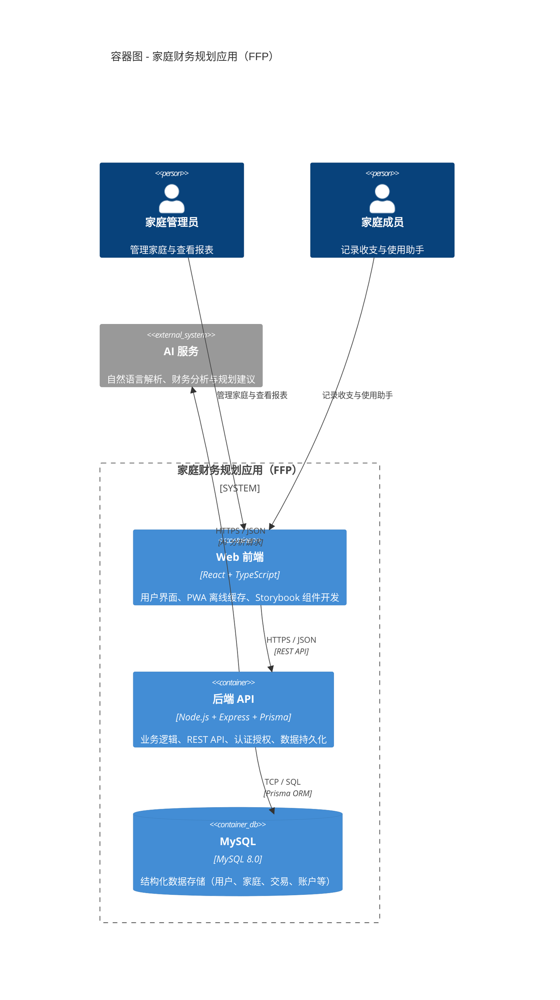
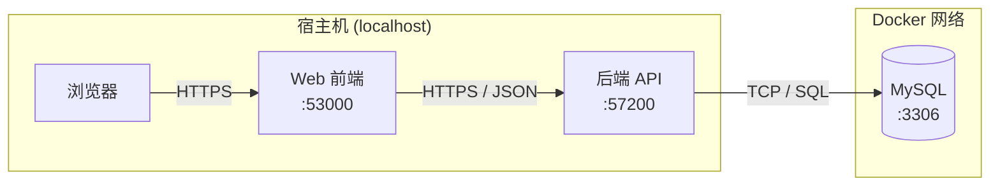
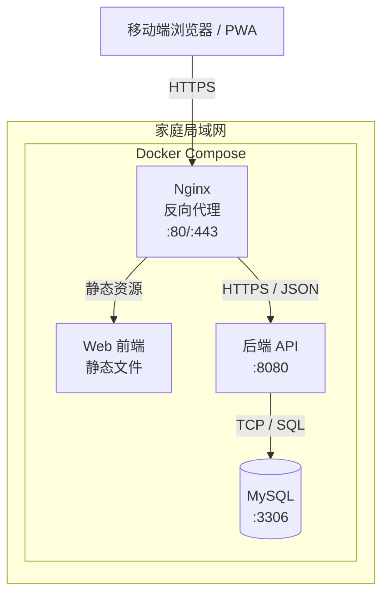

# l2-Container

本文档描述 FFP 系统的容器架构，展示系统由哪些可独立部署/运行的单元组成，以及它们之间的通信关系。

> Container 是可独立运行/部署的代码单元（如前端应用、后端服务、数据库）。不要与 Docker 容器混淆。
>
> **关联**：容器的运行时协作行为（跨容器调用链）见 [../dynamic/](../dynamic/)（C4 L4 Dynamic View）。

---

## 1 容器概览

---

## 2 容器说明

### 2.1 Web 前端

| 属性 | 说明 |
|------|------|
| **技术栈** | React 18 + TypeScript + Vite + Tailwind CSS + Shadcn/ui |
| **部署方式** | 静态文件（HTML/CSS/JS），可托管于任何 Web 服务器 |
| **运行环境** | 用户设备上的现代浏览器或已安装的 PWA |

**职责**：

- 用户界面渲染和交互
- 表单验证和用户输入处理
- 调用后端 REST API 获取/提交数据
- PWA 离线缓存（Service Worker）
- Storybook 组件开发和评审

**不做的事**：

- 业务逻辑决策（由后端处理）
- 数据持久化（依赖后端 API）
- 认证鉴权逻辑（依赖后端 JWT 验证）

### 2.2 后端 API

| 属性 | 说明 |
|------|------|
| **技术栈** | Node.js 20 + Express 4 + Prisma 6 + TypeScript |
| **部署方式** | Docker 容器化部署 |
| **运行环境** | Linux 容器 |

**职责**：

- HTTP API 路由和请求处理
- 业务逻辑处理（收入/支出/资产/负债管理）
- 认证授权（JWT 签发与验证）
- 数据持久化（通过 Prisma ORM 操作 MySQL）
- API 契约定义（OpenAPI 3.0）

**不做的事**：

- AI 模型推理（委托给外部 AI 服务）
- 文件存储（当前版本不涉及）

### 2.3 MySQL

| 属性 | 说明 |
|------|------|
| **版本** | MySQL 8.0 |
| **ORM** | Prisma 6 |
| **部署方式** | Docker Compose 或独立容器 |

**职责**：

- 结构化数据存储（用户、家庭、交易、账户等）
- 事务支持（ACID）
- 数据完整性保障（外键、约束）

### 2.4 AI 服务

| 属性 | 说明 |
|------|------|
| **类型** | 外部系统 |
| **作用** | 自然语言解析、财务分析与规划建议 |
| **接入方式** | 后端 API 通过 HTTPS 调用 |

**边界说明**：

- FFP 不内嵌 AI 模型，通过标准 API 调用外部服务
- 私有化部署场景下，可配置为本地部署的开源模型
- AI 服务不直接访问数据库，所有数据由后端 API 提供上下文

---

## 3 通信协议

| 调用路径 | 协议 | 数据格式 | 说明 |
|----------|------|----------|------|
| 用户浏览器 → Frontend | HTTPS | HTML / CSS / JS / JSON | 静态资源加载 + API 调用 |
| Frontend → Backend | HTTPS | REST / JSON | 完整 API 定义见 [OpenAPI 规范](./api/openapi.yaml) |
| Backend → MySQL | TCP | SQL | Prisma ORM 生成和执行的 SQL |
| Backend → AI 服务 | HTTPS | REST / JSON | 自然语言请求 / 分析结果响应 |

---

## 4 设计决策

### 4.1 为什么采用单体后端而非微服务

| 考量 | 决策 |
|------|------|
| **用户规模** | 家庭内协作场景，单家庭 3-5 人，单体足以支撑 |
| **运维复杂度** | 私有化部署目标下，单容器部署更简单 |
| **团队协作** | 1 人 + AI 协作，微服务拆分增加不必要的上下文切换成本 |
| **未来演进** | 若用户量增长，可按模块（Family / Finance）拆分 |

### 4.2 为什么使用 MySQL

| 考量 | 决策 |
|------|------|
| **数据关系** | 财务数据高度关系化（家庭-成员-交易-分类），关系型数据库天然适配 |
| **事务需求** | 收支记录/资产变化等操作需要强一致性事务 |
| **团队熟悉度** | 技术栈统一，Prisma 对 MySQL 支持完善 |
| **私有化部署** | MySQL 社区版免费，私有化部署无许可成本 |

### 4.3 为什么使用 PWA 而非原生 App

| 考量 | 决策 |
|------|------|
| **跨平台** | 一套代码覆盖 iOS / Android / Desktop |
| **无需安装** | 用户通过浏览器访问，降低使用门槛 |
| **私有化部署** | 局域网内通过 IP 访问即可，无需应用商店审核 |
| **离线能力** | Service Worker 支持基础离线功能 |

### 4.4 为什么前后端使用 REST 而非 gRPC

| 考量 | 决策 |
|------|------|
| **浏览器兼容性** | REST / JSON 是浏览器原生支持的标准 |
| **工具链成熟** | Express + OpenAPI 生态完善，文档和测试工具丰富 |
| **团队熟悉度** | 技术栈统一，学习成本低 |
| **性能需求** | 家庭财务场景无高并发要求，REST 性能足够 |

---

## 5 明确裁剪

以下业界常用方案在本项目中被**主动放弃**，原因如下：

| 原可选项 | 裁剪原因 |
|---------|---------|
| **微服务架构** | 家庭内协作场景（单家庭 3-5 人），单体后端足以支撑；私有化部署目标下单容器部署更简单 |
| **MongoDB** | 财务数据高度关系化（家庭-成员-交易-分类），关系型数据库天然适配；事务需求强 |
| **Redis 缓存** | 家庭级数据量小，MySQL 查询足够；无高并发场景，缓存收益低 |
| **gRPC** | 浏览器兼容性优先，REST/JSON 工具链更成熟；家庭财务场景无性能瓶颈 |
| **原生 App** | PWA 跨平台、无需应用商店审核、私有化部署通过 IP 即可访问 |
| **消息队列（RabbitMQ/Kafka）** | 当前无异步事件处理需求；若后续需要，可通过 Node.js 内置方案或 Temporal 替代 |

---

## 6 部署架构

> **注意**：以下部署拓扑**不属于 C4 Model 标准视图**。C4 Container 图描述的是逻辑容器及其通信关系（第 1-5 节），而部署拓扑描述的是物理/虚拟环境中的运行实例分布。本文档将其作为补充信息提供，便于开发者和运维人员理解实际部署方式。

### 6.1 开发环境

> **注意**：MySQL 端口仅在 Docker 网络内部暴露，不映射到宿主机。前端和后端端口使用高位端口（53000/57200）避免冲突。

### 6.2 生产环境（私有部署）

---

## 7 相关文档

- [c4-l1-context.md](context.md) — 系统上下文（Person、外部系统、业务边界）
- [c4-l3-component.md](component.md) — 组件视角（每个容器内部的组件分解）
- [../dynamic/](../dynamic/) — 行为视图（C4 L4 Dynamic View，跨容器调用链 sequenceDiagram）
- [data-model.md](../../data/data-model.md) — 领域模型（实体定义、ER 关系）
- [API 规范](../../api/openapi.yaml) — OpenAPI 定义
- [架构决策](../../decisions/) — ADR 记录（目录链接）
