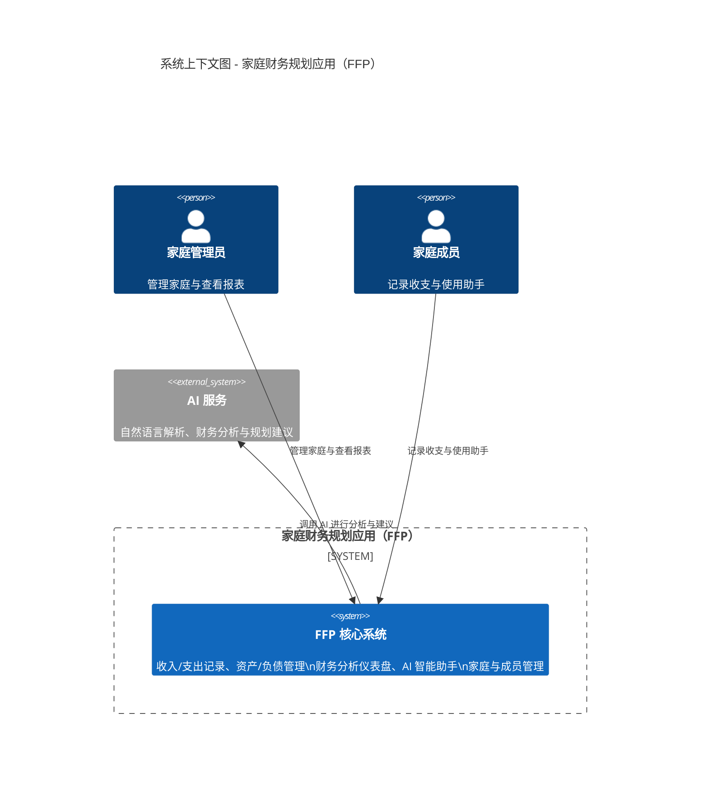
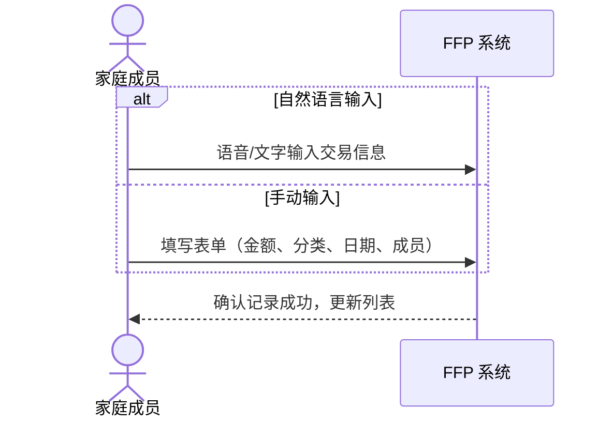
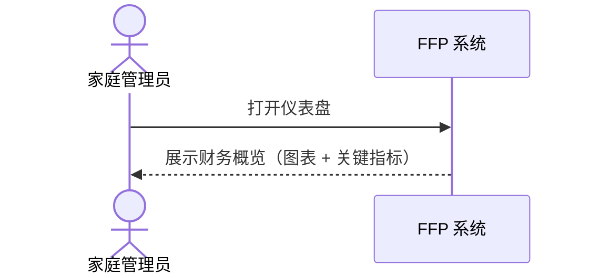
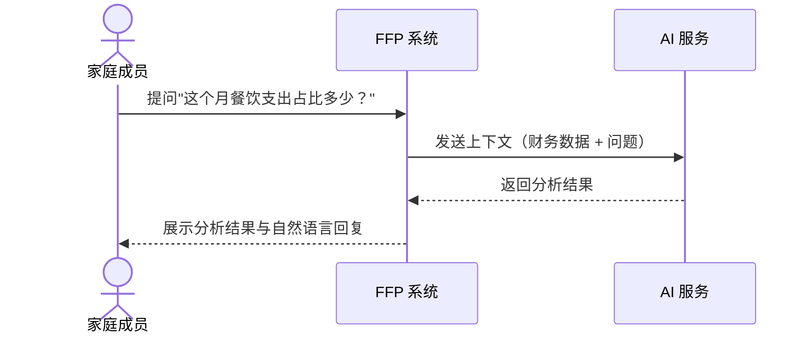

# l1-Context

本文档描述 FFP 系统的外部视角，展示系统与用户、外部系统的交互边界。

> 本文档遵循 [C4 Model](https://c4model.com/) 架构文档规范。
>
> - L1 Context：系统与外部角色、外部系统的关系
> - L2 Container：系统内部的可独立部署/运行单元
> - L3 Component：容器内的代码模块及其协作关系
> - L4 Dynamic（Behavior）：系统运行时行为（sequenceDiagram），见 [../dynamic/](../dynamic/)
> - L4 Code：不维护（代码即事实源）

---

## 1 系统概述

**家庭财务规划应用（FFP）** 是一款面向家庭用户的财务规划应用，主要面向 3-5 人的家庭单位，帮助用户对收入、支出、资产和负债进行记录和监控，并通过 AI 辅助进行财务规划和管理。

**核心产品价值**：

- **统一财务数据源**：整合不同来源的财务数据，构建以家庭为中心的统一数据源
- **智能辅助决策**：通过 AI 智能体为家庭用户提供财务分析、规划建议和投资指导
- **可视化财务洞察**：提供直观的财务概览仪表盘，帮助用户快速获取家庭财务概况和趋势
- **便捷交互体验**：支持自然语言、语音、图片等多种交互方式
- **私有化部署支持**：支持在家庭局域网内部署，确保数据隐私

---

## 2 系统上下文图

---

## 3 核心系统能力

FFP 系统对外提供以下能力：

| 能力 | 说明 |
|------|------|
| **收入管理** | 收入记录的增删改查，包含日期、成员、类别和金额 |
| **支出管理** | 支出记录的增删改查，支持二级分类体系 |
| **资产管理** | 资产余额记录的增删改查，支持资产类型分类 |
| **负债管理** | 负债余额记录的增删改查，支持负债类型分类 |
| **财务分析** | 基于收入、支出、资产和负债数据的统计分析与可视化 |
| **智能助手** | 基于 AI 的财务助手，支持自然语言交互、语音输入、图片识别 |
| **家庭管理** | 家庭配置、成员管理、分类体系自定义 |

---

## 4 外部角色

| 角色 | 定义 | 与系统的关系 | 边界说明 |
|------|------|-------------|----------|
| **家庭管理员** | 家庭组织内的管理者 | 主要操作者，负责家庭配置、成员邀请、分类体系管理 | 可执行所有功能，包括仅管理员可用的配置操作 |
| **家庭成员** | 家庭组织内的普通用户 | 日常使用系统记录和查看财务数据 | 可记录收支、查看资产/负债、使用智能助手，不可管理家庭配置 |

> **未来角色**：系统管理员（多租户系统运维）—— 当前版本暂不支持，后续版本按需引入。

---

## 5 外部系统依赖

| 系统 | 作用 | 边界说明 |
|------|------|----------|
| **AI 服务** | 自然语言解析、财务分析与规划建议 | 通过 API 调用外部 LLM 服务，不内嵌模型 |

> **部署说明**：FFP 支持私有化部署，AI 服务可配置为本地部署的开源模型（如 Ollama）或云端 API（如 GLM / Kimi）。

---

## 6 明确在边界外

以下领域**不在** FFP 系统边界内：

| 领域 | 说明 |
|------|------|
| **银行 API 集成** | 不与银行等外部金融机构直接对接获取账单数据 |
| **投资交易执行** | 仅提供投资建议和分析，不执行实际交易 |
| **第三方支付** | 不涉及支付、转账、资金流转功能 |

---

## 7 关键业务流

### 7.1 记录一笔支出

### 7.2 查看家庭财务概览

### 7.3 使用智能助手咨询

---

## 8 相关文档

- [c4-l2-container.md](container.md) — 容器视角（前端应用、后端服务、数据库的部署结构）
- [c4-l3-component.md](component.md) — 组件视角（前端组件分层、后端模块划分）
- [../dynamic/](../dynamic/) — 行为视图（C4 L4 Dynamic View，运行时业务流程 sequenceDiagram）
- [data-model.md](../../data/data-model.md) — 领域模型（实体定义、ER 关系）
- [API 规范](../../api/openapi.yaml) — OpenAPI 定义
- [架构决策](../../decisions/) — ADR 记录（目录链接）
