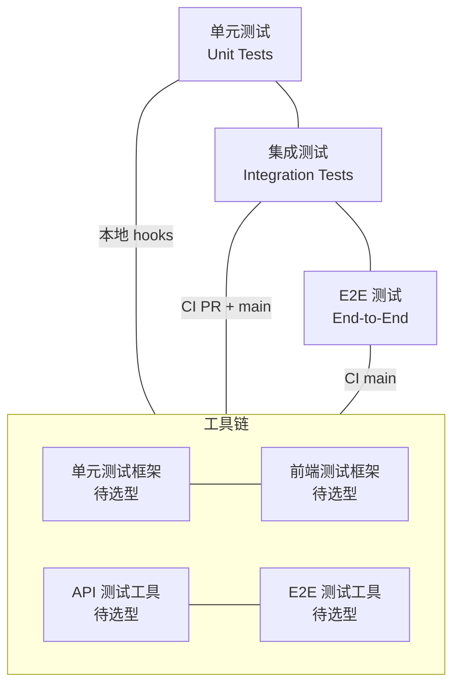
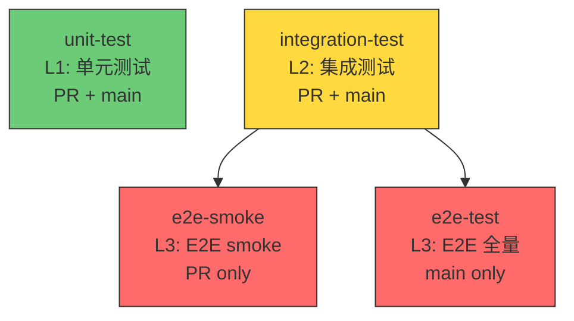
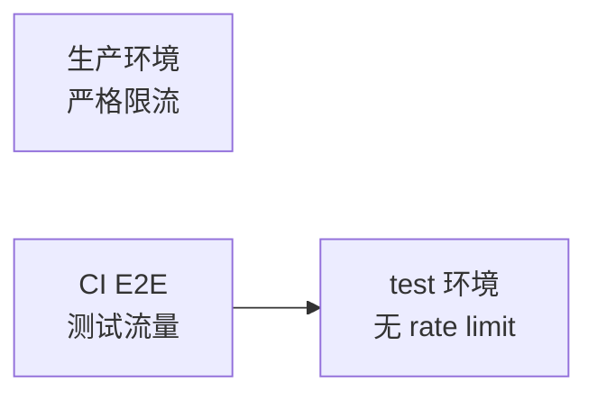
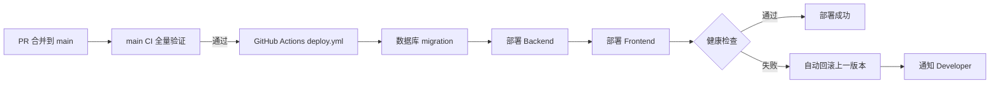

# 质量管道：测试策略与 CI/CD 设计

本文档是 FFP 项目的质量保障体系总纲，涵盖测试策略与 CI/CD 设计。操作性命令和目录结构以 `package.json` 和实际代码为准。

---

## 1. 背景与目标

### 1.1 项目上下文

| 维度 | 描述 |
|------|------|
| **开发模式** | 单人 + AI（Claude）协作 |
| **代码库** | Monorepo（backend + frontend + tests） |
| **技术栈** | Node.js / 关系型数据库 / 待选型（ORM、测试框架在 feature 设计阶段确定） |
| **发布模式** | 持续交付（部署阶段预留，当前仅做 CI 验证） |
| **CI 平台** | GitHub Actions（免费版，2000 min/月 Linux） |

### 1.2 设计目标

```text
目标：快；本地为主、CI 为辅；main 有安全网；失败后本地可复现
```

| 目标 | 含义 |
|------|------|
| **快** | PR CI 完成（unit + integration + e2e-smoke）< 5 min；main 验证 < 10 min |
| **本地为主** | pre-commit hooks 是主要防线，CI 只验证本地无法覆盖的部分 |
| **有效保护** | main 的每次 push 有安全网（集成 + 关键 E2E） |
| **易于调试** | 本地和 CI 环境一致，失败后无需重跑 CI |

### 1.3 设计约束

1. **单人开发**：pre-commit hooks 是 lint 和单元测试的主要防线，CI PR 阶段做快速兜底验证
2. **资源有限**：GitHub 免费版 2000 min/月，单次 run 必须控制在 10 min 内
3. **工具链统一**：backend（Node）+ frontend（Node）+ Playwright（浏览器）
4. **数据库版本化**：schema 变更必须通过 migration 管理，不能 force push
5. **环境一致**：本地和 CI 使用相同端口、相同服务启动方式

---

## 2. 测试分层策略

<a id="test-layering"></a>

### 2.1 三层测试模型



| 层级 | 测试目标 | 工具 | 触发时机 | 超时预算 |
|------|----------|------|----------|----------|
| **L1 单元** | 组件/函数逻辑 | 待选型 | 本地 pre-commit hooks + **CI：PR 快速验证** | < 2 min |
| **L2 集成** | 业务流程（API 层） | 待选型 | CI：PR + main push | < 5 min |
| **L3 E2E** | 关键用户路径（浏览器） | 待选型 | CI：PR smoke + main push 全量 | < 10 min |

### 2.2 双测试框架的边界

FFP 长期并存两套测试基础设施：

| 框架 | 位置 | 依赖 | 驱动力 | 适用场景 |
|------|------|------|--------|----------|
| **集成测试** | 待确定 | 待选型 | 待配置 | **API 层**业务流程验证（无浏览器） |
| **E2E 测试** | 待确定 | 待选型 | 待配置 | **UI 层**端到端用户流程（含浏览器） |

**"通过测试"在本项目的确切含义**：

- 各模块单元测试全绿（husky pre-commit + **CI PR 强制**）
- 集成测试全绿（CI 强制，每 PR 跑）
- E2E smoke tests 全绿（CI PR 强制）+ 全量全绿（main push）

任一层红 = 测试未通过。

<a id="l1-unit-tests"></a>

### 2.3 各层定义

#### L1 单元测试（Unit Tests）

**目标**：验证每个模块的内部逻辑正确性

**位置**：待 feature 开发阶段确定（建议各模块内部 `__tests__/` 目录）

**框架**：待选型

**执行**：

- 本地 pre-commit hooks 强制执行（主要防线）
- **CI PR 阶段**：门槛 60%（低于则失败）
- **main push 阶段**：门槛 80%（低于则 pipeline 失败）

**覆盖目标与门槛配置**：详见 [`engineering`](../../.claude/skills/engineering/SKILL.md) Skill。

#### L2 集成测试（Integration Tests）

**目标**：验证业务流程（多个 API 串联）的正确性

**位置**：待 feature 开发阶段确定

**执行**：待配置

**关键设计**：集成测试用例由 Tester 基于该契约手工设计，不采用自动生成——生成代码的维护成本和可读性在单人项目中不如手工编写可控。

<a id="l3-e2e"></a>

#### L3 E2E 测试（End-to-End）

**目标**：验证关键用户路径在真实浏览器中的端到端体验

**位置**：待 feature 开发阶段确定

**触发条件**：

- **PR**：集成测试通过后，执行 smoke tests
- **main push**：集成测试通过后，执行全量 E2E

**执行**：待配置

**覆盖目标**：核心用户路径（auth、income record、category）

#### E2E 分层触发策略

| 阶段 | 执行范围 | 触发时机 | 目的 |
|------|----------|----------|------|
| **PR smoke** | 标记为 `@smoke` 的测试用例 | 每个 PR | 阻止明显破坏核心流程的代码合入 |
| **main 全量** | 全部 E2E spec | main push | 完整安全网，覆盖非核心路径 |

**为什么 PR 不跑全量 E2E？**

- 全量 E2E 耗时最长、最容易 flaky，会拖慢开发节奏
- smoke tests 通过标签动态筛选，通常 < 3 min，成本可控
- main push 时跑全量作为最终安全网

**Smoke 用例维护**：规范与职责见 `test-execution` Skill。

---

## 3. CI Pipeline 架构

### 3.1 Job 总览

| Job | 测试类型 | 触发 | 依赖 | 预估时长 |
|-----|----------|------|------|----------|
| `unit-test` | 单元 | PR + main | 无 | ~1 min |
| `integration-test` | 集成 | PR + main | 无 | ~3 min（有缓存） |
| `e2e-smoke` | E2E smoke | PR | integration-test | ~3 min（有缓存） |
| `e2e-test` | E2E 全量 | main push | integration-test | ~8 min（有缓存） |

**PR wall-clock 时间**：unit + integration 并行 → e2e-smoke 串行 = **~4-5 min**

**main wall-clock 时间**：unit + integration 并行 → e2e-test 串行 = **~10 min**

### 3.2 依赖图



### 3.3 Job 定义引用

CI pipeline 的完整实现见 `.github/workflows/ci.yml`（文件顶部有策略文档反向链接）。本文档不重复操作命令与参数。

| Job | 策略定位 |
|-----|---------|
| `unit-test` | PR + main 并行；main 阶段动态提升覆盖率门限 |
| `integration-test` | PR + main 并行；真实 MySQL；建表后跑 |
| `e2e-smoke` | PR only；串行在 integration-test 后；smoke 筛选 |
| `e2e-test` | main only；串行在 integration-test 后；全量 |

测试框架配置待 feature 开发阶段确定。

---

## 4. 测试数据

### 4.1 Seed 脚本

Seed 脚本待 feature 开发阶段实现。策略：每个测试环境独立准备基础数据，测试用例自包含。

### 4.2 E2E 测试数据

E2E 测试应通过工厂模式创建独立测试数据，不依赖 seed 预置数据。详见 `e2e-playwright` Skill。

### 4.3 Seed 策略矩阵

| 环境 | Seed 策略 |
|------|----------|
| **本地 dev** | 待配置 |
| **CI 测试** | 每个需要 DB 的 Job 显式准备基础数据 |
| **生产** | 不 seed（生产有真实数据） |

**Seed 原则**：

- `seed:demo` 只插入测试必需的基础数据
- 测试用例不应依赖特定的 seed 数据（测试应自包含）
- E2E 测试需要 `test@example.com` 用户，必须 seed

### 4.4 测试用例资产注册表

中长期测试资产视图见 `docs/architecture/test-registry.md`（全局 evergreen 工件）。

**双层资产模型**：

```text
Feature 快照层（frozen）          全局注册表层（evergreen）
├─ ft-001/test-cases/test-plan.md  ├─ docs/architecture/test-registry.md
├─ ft-002/test-cases/test-plan.md  │   （手动维护，定期聚合）
└─ ...                             └─ scripts/generate-test-registry.js
                                        （可选：从 test-plan.md 自动生成）
```

**维护规则**（详见 `test-execution` Skill）：

| 动作 | 触发者 | 时机 |
|------|--------|------|
| 新增 | Tester | Feature Testing 阶段 |
| 审查 | Tester | 每 5 个 Feature Done 后 |
| 自动化 | CI | 每次 main CI 后（可选） |

---

## 5. 本地开发与 CI 一致性

### 5.1 端口约定

| 服务 | 开发环境 (dev) | 生产 / CI 服务端口 | 说明 |
|------|---------------|-------------------|------|
| Backend API | **57200** | **8080** | dev 用高位端口避免冲突；生产/CI 统一为 8080 |
| Frontend | **53000** | **3000** | dev 用高位端口；生产/CI 统一为 3000 |
| MySQL | Docker 内部 3306 | Service Container 3306 | 通过 `DATABASE_URL` 配置 |

**原则**：同一环境内端口保持一致，环境差异通过 `.env` 文件管理，不通过硬编码。开发环境使用高位端口（53000/57200）避免与系统服务冲突。

### 5.2 本地 E2E 脚本

本地和 CI 使用相同端口、相同启动方式。E2E 脚本待实现阶段配置。

核心原则：

- 端口统一：backend 8080，frontend 3000
- 服务就绪检查与 CI 使用相同逻辑（health endpoint 轮询）
- 失败时自动 tail 日志

### 5.3 E2E 测试的 Rate Limit

**长期方案**：E2E 测试使用**独立 test 环境**，与生产环境完全隔离。



**环境隔离要求**：

| 维度 | 生产环境 | test 环境 |
|------|---------|----------|
| **Rate limit** | 严格（按用户/IP 限制） | 不限制（仅用于自动化测试） |
| **数据库** | 生产数据 | 独立 `ffp_test` 数据库，每次 E2E 前 seed |
| **部署来源** | main merge + 人工确认 | main CI 全绿后自动部署 |
| **域名** | `app.example.com` | `test.example.com`（内部） |

**当前过渡方案**（test 环境未就绪前）：

E2E 测试环境方案待实现阶段确定。生产环境绝对禁止识别任何测试专用 header。

**过渡方案安全约束**：

- `X-E2E-Test` header 仅在 `TEST_ENV=integration` 或 `NODE_ENV=test` 时被识别
- 生产环境服务端**必须忽略**该 header，代码中通过环境变量严格隔离
- test 环境就绪后立即删除过渡方案

### 5.4 变更检测跳过无关 CI Job

PR 仅修改 `docs/`、`.claude/`、`.github/workflows/*.md` 等纯文档时，跳过 unit-test / integration-test / E2E 等耗时 Job。通过 `detect-changes` Job 做路径过滤，后续 Job 按需条件执行。实现见 `.github/workflows/ci.yml`。

---

## 6. 基础设施策略

### 6.1 缓存策略

GitHub Actions 免费版 2000 min/月，缓存是控制配额消耗的关键。

| 缓存项 | 命中后节省 | 管理方式 |
|--------|-----------|---------|
| `node_modules` | ~30-60s | `actions/setup-node` 自动管理 |
| 测试框架/浏览器缓存 | ~30-60s | `actions/cache` 手动配置 |
| ORM/编译产物缓存 | ~10-20s | `actions/cache` 手动配置 |

具体配置见 `.github/workflows/ci.yml`。缓存命中后的时间估算：

| Job | 无缓存 | 有缓存 | 节省 |
|-----|--------|--------|------|
| integration-test | ~5 min | ~3 min | ~40% |
| e2e-test | ~12 min | ~8 min | ~33% |

### 6.2 数据库 Migration 策略

**核心原则**：

```text
Schema 变更 = 特性的一部分，migration 文件需要 code review
```

**数据库 Migration 策略**：

Schema 变更 = 特性的一部分，migration 文件需要 code review。

| 维度 | 版本化 Migration | 直接同步 |
|------|------------------|----------|
| **用途** | 生产部署的标准路径 | 开发环境的快速同步 |
| **版本历史** | 每个 migration 有文件 | 无 |
| **回滚** | 有版本可回滚 | 困难 |
| **生产安全** | 是 | 可能丢数据 |
| **CI 适用** | 是 | 仅开发/测试 |

**Migration 工作流**（ORM 选型后细化）：

```text
feature/ft-xxx-add-income-category
|
├── 数据库 schema / migrations    # 修改表结构
└── backend/src/...               # feature 代码
```

**CI 中的 Migration 规则**：

- CI 只执行 deployment-grade migration，不执行 development-grade migration
- 新 migration 在 feature branch 中通过 PR review 生成
- 直接 schema push 在 CI 中**禁止使用**
- 具体实现见 `.github/workflows/ci.yml`

### 6.3 健康检查策略

MySQL 健康检查使用**实际连接测试**（`mysql -u ... -e 'SELECT 1'`），替代 `mysqladmin ping`。实际连接测试同时验证认证和系统表初始化完成，而 `mysqladmin ping` 只证明进程存在。

具体参数见 `.github/workflows/ci.yml`。关键设计要点：

- 后端就绪验证 response body（不只是 HTTP 200）
- 前端单独检查，确保构建完成后再启动 E2E
- 失败时自动 tail 日志

服务等待脚本待实现阶段配置。

---

## 7. 资源与配额管理

### 7.1 Concurrency 配置

同一 workflow 的旧 run 被新 push 取消，避免浪费配额。实现见 `.github/workflows/ci.yml`。

### 7.2 资源预算

| Job | 预估时长（无缓存） | 预估时长（有缓存） |
|-----|-------------------|-------------------|
| integration-test | ~5 min | ~3 min |
| e2e-test | ~12 min | ~8 min |

**PR 反馈时间**：integration-test only = **~3 min**

**main push 反馈时间**：integration + e2e = **~8 min**（串行，e2e 依赖 integration）

### 7.3 月度配额估算

假设每天 **5 次 PR** + **5 次 main push**（AI agent 开发节奏比手动开发更频繁）：

| 场景 | 次数/天 | 单次耗时 | 月度总计 |
|------|---------|----------|----------|
| PR（unit + integration 并行） | 5 | 3 min | 450 min |
| PR（e2e-smoke） | 5 | 3 min | 450 min |
| main push（unit + integration + e2e 全量） | 5 | 10 min | 1500 min |
| **合计** | | | **~2400 min** |

**注意**：免费版配额 2000 min/月，当前估算已超配。优化方案：

1. **unit-test 不消耗 runner 时间**：如果 backend/frontend 单元测试可在同一 runner 内快速完成（< 1 min），实际增加有限
2. **e2e-smoke 失败时取消后续 job**：利用 `cancel-in-progress` 避免浪费
3. **AI agent 批量提交**：agent 可将多次修改批量 push，减少 CI 触发次数
4. **如仍超配**：考虑升级为 GitHub Pro（3000 min/月）或选择性跳过非关键 PR 的 e2e-smoke

**优化后估算**（agent 批量提交，每天实际 3 次 PR + 3 次 main）：

| 场景 | 次数/天 | 单次耗时 | 月度总计 |
|------|---------|----------|----------|
| PR（unit + integration + e2e-smoke） | 3 | 5 min | 450 min |
| main push（unit + integration + e2e 全量） | 3 | 10 min | 900 min |
| **合计** | | | **~1350 min** |

**余量**：2000 - 1350 = **650 min/月**（约 32% 余量），用于失败重试、手动触发。

### 7.4 工件保留策略

| 工件 | 内容 | 保留期 | 上传条件 |
|------|------|--------|----------|
| `integration-junit.xml` | JUnit 报告 | 14d | always |
| `e2e-playwright/` | HTML + 截图 + 视频 | 14d | failure only |
| `e2e-service-logs/` | backend.log + frontend.log | 7d | failure only |

**精简原则**：

- 单人项目不需要长期保留工件，14 天足够 debug
- Playwright 报告和日志只在**失败时**上传，节省 storage

---

## 8. 失败处理与重试

### 8.1 失败时的诊断信息

| Job | 必须上传的诊断信息 |
|-----|-------------------|
| unit-test | test failure details |
| integration-test | test failure details、JUnit XML |
| e2e-smoke / e2e-test | screenshot + video + backend.log + frontend.log（失败时） |

### 8.2 重试策略

| 层级 | 重试次数 | 原因 |
|------|----------|------|
| 单元测试 | 0 | 本地 hooks + CI 双重验证，应绝对稳定 |
| 集成测试 | 0 | 依赖真实 DB，应该稳定 |
| E2E 测试 | 1（CI only） | 浏览器测试有 flaky 风险；重试通过的测试必须在 48h 内登记到 GitHub Issues（标签 `flaky-test`）并限期修复 |

**本地开发**：E2E 失败即停，**禁止重试**。强制开发者在本地修复 flaky 问题后再提交。

### 8.3 Flaky 测试管理

处理流程与职责见 `tester.md` 和 `test-execution` Skill。追踪清单维护于 GitHub Issues（标签 `flaky-test`）。

---

## 9. 部署规范（预留，当前未启用）

> **状态**：文档预定义，当前阶段不实施。等有生产环境需求时直接启用。
> **流程引用**：研发流程文档见 `docs/process/README.md`。

### 9.1 deploy.yml 的定位

`deploy.yml` 是 GitHub Actions 的 Workflow 文件，**本身不承载应用**，而是**编排部署动作**。

```text
GitHub Actions Runner (免费版 2000 min/月)
    |
    ├── 执行测试 (ci.yml) <- 已启用
    |
    └── 执行部署 (deploy.yml) <- 预留，未启用
            |
            ▼
        通过 SSH / Docker / 云平台 API
            |
            ▼
        目标服务器（阿里云 ECS / VPS / 自有服务器）
```

### 9.2 目标环境要求

| 维度 | 要求 | 说明 |
|------|------|------|
| **服务器** | 任意 Linux 服务器 | 阿里云 ECS、腾讯云 CVM、VPS 均可 |
| **运行方式** | Docker 或 PM2 | 推荐 Docker（环境一致性） |
| **数据库** | MySQL 8.0 | 与开发和 CI 版本一致 |
| **网络** | 公网 IP + HTTPS | 建议配域名和 SSL |
| **GitHub 连接** | SSH Key 或 API Token | deploy.yml 通过 secrets 认证 |

### 9.3 两层环境模型

| 环境 | 定位 | 部署方式 | 当前状态 |
|------|------|---------|---------|
| **CI 环境** | 自动化验证环境（替代传统 Staging） | 每次 PR/push 自动创建容器 | 已启用 |
| **Prod** | 生产环境 | main merge 后自动部署 | 预留，未启用 |

**Dev 环境**不需要独立部署——本地 `npm run dev` 即为 Dev。

### 9.4 部署流程



**部署顺序**：

1. PR 合并到 main
2. main CI 全量验证通过（integration + e2e）
3. 触发 `deploy.yml`
4. 执行数据库 migration（数据库变更先）
5. 部署 Backend + Frontend
6. 健康检查（`/api/v1/health` 返回 `{"status":"ok"}`）
7. 失败 -> 自动回滚到上一个稳定版本

### 9.5 回滚策略

**不可用判定标准**（触发自动回滚的阈值）：

- 部署后 5 分钟内 `/api/v1/health` 连续 3 次返回非 200
- 或错误率超过 5%（基于应用监控，预留接入点）

| 场景 | 回滚操作 | 负责 |
|------|---------|------|
| 代码 bug | Git revert + 重新触发 deploy | Developer |
| 迁移破坏性 | 数据库备份恢复 + 代码回滚 | Developer |
| 服务不可用 | Docker 切回上一个镜像 / PM2 切回上一个版本 | Developer |

### 9.6 启用条件

- [ ] 有外部用户需要访问
- [ ] 服务器环境已准备
- [ ] 域名 + HTTPS 已配置
- [ ] 数据库备份策略已就绪

---

## 10. 实现参考

本文档定义策略与分层设计，具体实现参见：

| 实现 | 位置 |
|------|------|
| CI Pipeline | `.github/workflows/ci.yml` |
| 测试框架配置 | 待 feature 开发阶段确定 |
| 流程合规检查 | `.claude/hooks/` |

---

## 11. 测试报告

E2E 测试完成后生成 HTML 报告。具体查看方式待测试框架选型后确定。

---

## 附录

### A. 相关文档

- [Data Model](../../data/data-model.md) -- 数据模型
- [研发流程](../process/README.md) -- 多智能体研发流程

### B. 参考

- [GitHub Actions 文档](https://docs.github.com/en/actions)
- [Prisma Migrate](https://www.prisma.io/docs/guides/database-management/database-migrations)
- [Playwright](https://playwright.dev/)
