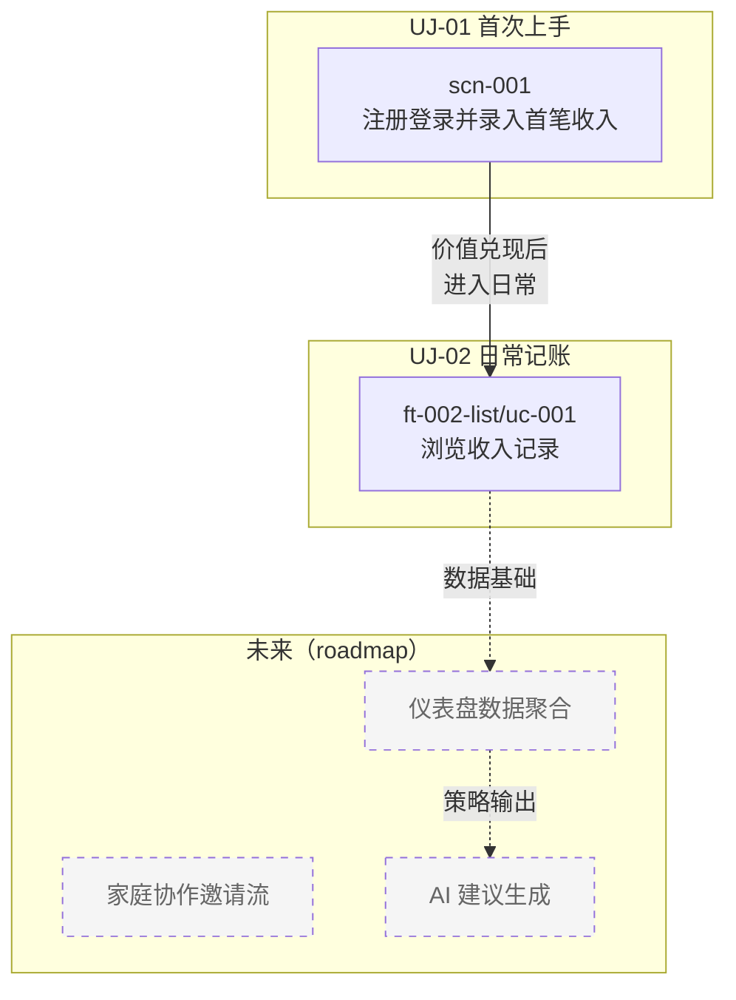

# Scenarios（跨 Feature 场景视图）

> **定位**：跨 Feature 的端到端系统场景。把"用户从入口到价值兑现"这件事作为**活的架构视图**维护——C4 讲结构，ADR 讲决策，UJ 讲用户旅程，本目录讲**系统怎么串起来实现旅程**。

Simon Brown C4 Model 中对应 **Dynamic View**（第 4 层），但我们用 `scenario` 命名，以强调其与用户故事的天然对齐。

---

## 1 与相邻层的关系

| 层 | 视角 | 内容 | 读者 |
|----|------|------|------|
| **User Journey** (`docs/business/user-journeys/`) | 用户视角 | 端到端目标、情绪曲线、痛点 | 产品经理、Designer |
| **Scenario** (本目录) | 系统视角 | 跨 Feature 的 API/交互/数据流 | 架构师、Reviewer |
| **Feature UC** (`docs/backlog/{epic}/{feature}/uc-*.md`) | Feature 视角 | 单 Feature 内的分支/失败路径 | Developer、Tester |
| **US** (`docs/backlog/{epic}/{feature}/us-*.md`) | 验收视角 | AC 明确的用户故事 | Developer、Tester |

**单向依赖链**：Journey → Scenario → Feature UC/US

- Journey 是 Scenario 的输入（Scenario 回答"系统如何实现这段旅程"）
- Scenario 是 Feature 设计的输入（Designer 理解跨 Feature 边界后拆 US/UC）
- Feature 完成后，Tester 回填 Scenario 注册表的"AT 覆盖"列

---

## 2 业务能力全景图

> 虚线节点 = 尚无跨 Feature 场景，仅为规划占位；实线节点 = 已起草。

---

## 3 Scenario 注册表

| ID | 名称 | 优先级 | 支撑 Journey | 关联 Feature | AT 覆盖 | 状态 |
|----|------|--------|-------------|--------------|---------|------|
| scn-001 | [注册登录并录入首笔收入](./scn-001-first-time-setup.md) | P0 | UJ-01 | ft-003-auth → ft-001-create | — | ✅ 已起草 |

**总量硬顶**：≤ 10 条活跃 scenario。超过意味着颗粒度出问题——要么合并、要么下沉到 Feature UC。

**AT 覆盖列**：P0 / P1 scenario 的 main path 应在某 Feature 的 acceptance test 里被覆盖一次。Tester 在 feature 收尾仪式中回填对应 AT 文件的相对路径。

---

## 4 ID 与优先级规则

### 4.1 ID 命名

- 格式：`scn-XXX`，3 位数全局递增，永不复用（参见 [ADR-003](../../decisions/ADR-003-naming-convention.md)）
- 文件名：`scn-XXX-<kebab-slug>.md`
- 废弃的 scenario 在注册表里用 `(retired)` 标记保留行，不删行

### 4.2 何时新建 Scenario（硬边界）

必须**同时满足**以下两条：

1. **跨 Feature**：≥ 2 个 Feature 协作才能跑通的链路
2. **跨 Epic 或 North-star**：跨 Epic / 跨 Theme，或用户从入口到价值兑现的最短闭环

**不满足上述条件的，不要开 scenario**，用 Feature 内的 `uc-*.md` 解决。

### 4.3 何时下沉到 Feature UC

以下情况，scenario 内容应移到 `docs/backlog/{epic}/{feature}/uc-*.md`：

- 只涉及 1 个 Feature 的交互（如纯查询列表、单表单提交）
- 没有跨系统边界的 API 调用
- 错误路径都在同一 Feature 内闭环

**示例**：
- `ft-002-list`（浏览收入记录）= 单 Feature 查询 → **下沉为 `ft-002-list/uc-001.md`**
- `ft-001-create` + `ft-003-auth`（注册后首笔录入）= 跨 Epic → **保留为 scn-001**

### 4.4 优先级语义

| 优先级 | 含义 |
|--------|------|
| **P0** | 基础场景：没有它，产品价值无法兑现 |
| **P1** | 核心价值场景：产品的主要差异化能力 |
| **P2** | 扩展场景：提升完整性，非核心路径 |
| **P3** | 补完场景：不常用但必须存在 |

---

## 5 文件形态约束

每个 scenario 文件必须满足：

1. **frontmatter**：`type: scenario`、`lifecycle: evergreen`、`id: scn-XXX`、`priority: P0|P1|P2|P3`、`related-features: [ft-XXX, ...]`、`journeys: [UJ-XX]`
2. **主路径**：用 mermaid `sequenceDiagram` 呈现，不写 Cockburn 长段落
3. **Journey stages**（可选）：3~4 行精简表，对应 UJ 的阶段
4. **关联 Features**：纯文本 ID 列表（ Feature 目录可能尚未创建，不写 markdown 链接）
5. **维护触发器**：明确列出"改到哪些 feature 应该回看本 scenario"
6. **硬性行数上限 150 行**：超了就是颗粒度信号——分拆或下沉

---

## 6 维护规则

### 6.1 何时更新

PR 改动了任一 scenario 的**步骤 / 顺序 / 错误路径 / Actor 边界**时：

- PR 模板（`.github/PULL_REQUEST_TEMPLATE.md`）的 "Scenario impact" 段二选一勾选
- **Designer** 在 `design.md` 起草时标出 "Scenario 影响"
- **Reviewer** 在代码评审里检查 scenarios/ 是否同步更新——未更新 = Changes Requested
- **Tester** 在收尾仪式同步 feature.md `## 关联 Scenario` 到 `state.md`，并回填注册表"AT 覆盖"列
- evergreen 政策：内容过时 = bug，当次 PR 顺带修，不另立 TD

### 6.2 何时退役

产品方向调整导致场景不再存在时：

- 注册表保留行，标 `(retired)`
- 文件保留但 frontmatter 加 `lifecycle: frozen` + `supersededBy: <说明>`
- 从能力全景图中移除节点

---

## 7 与其他层的关系

| 层 | 关系 |
|----|------|
| [C4 Context/Container/Component](../c4/) | C4 是**结构视图**；本目录是**行为视图**（C4 第 4 层 Dynamic View） |
| [data-model.md](../../data/data-model.md) | scenario 里的数据操作应能在 data-model 里找到实体支撑 |
| [OpenAPI](../../api/openapi.yaml) | scenario 步骤中涉及的 API 调用应在 OpenAPI 里有契约 |
| [Product-Backlog](../../backlog/Product-Backlog.md) | Theme/Epic/Feature 是**纵切业务领域**；scenario 是**横切系统交互**，两者正交 |
| [User Journeys](../../business/user-journeys/) | Journey 是**用户想要什么**；scenario 是**系统怎么实现** |

---

## 8 新增 scenario 流程

1. 在本文件 §3 注册表追加一行（先占 ID）
2. 在 §2 能力全景图里加节点
3. 在对应 UJ 文件里增加"涉及 Scenario"段
4. 按 §5 约束起草 `scn-XXX-<slug>.md`
5. 单独开 PR（`docs/<slug>` 分支），Reviewer 审图+文一并
