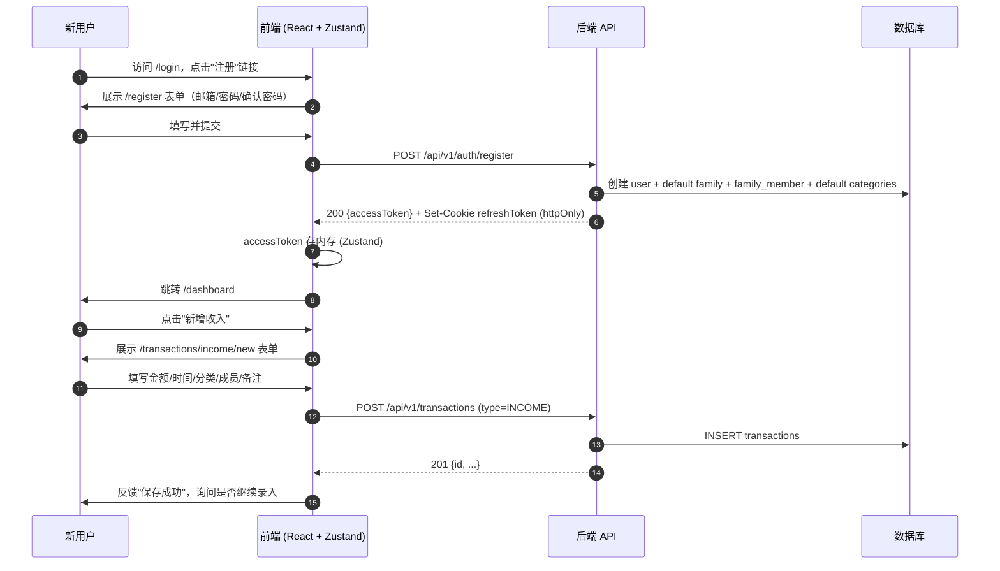

# scn-001 注册登录并录入首笔收入

> **North-star 场景**：新用户从第一次进入站点到在数据库里留下第一条属于他家庭的收入记录。跨 TH-02（认证授权）+ TH-01（财务记录管理），是用户感知产品价值的最短闭环。
>
> 对应 [UJ-01 首次上手](../../business/user-journeys/UJ-01-first-time-setup.md) 的阶段 2~4。

---

## Actors

- **Primary**: 新用户（未注册）
- **Secondary**: 系统（自动初始化家庭 / 默认分类 / 成员关系）

## Preconditions

- 浏览器能访问前端地址
- 后端 API 可用（`/api/v1/auth/*`、`/api/v1/transactions`）
- 邮箱地址未被占用

## Trigger

用户在未登录状态访问任意路径——`/` / `*` 统一 `Navigate` 到 `/login`，本场景从用户点击"注册"起算。

---

## Main path

**价值兑现点**：步骤 15（DB 留下第一条 INCOME 记录）——用户完成从"陌生人"到"拥有家庭财务数据"的身份转变。

---

## Journey stages

| 阶段 | 主要任务 | 关键触点 | 优化建议 |
|------|----------|----------|---------|
| **账户注册** | 填写邮箱/密码 → 提交 | `/register`、密码强度提示 | 社交登录、表单自动填充、实时校验 |
| **家庭初始化** | 系统自动完成 | 默认家庭名 / 默认分类 | 首次登录提示"你的家庭已创建" |
| **首次价值兑现** | 录入第一笔收入 | `/dashboard` CTA → 表单 | 仪表盘空态引导"从一笔收入开始" |

---

## Business rules / 关键约束

- **原子性**：register 端点要么全部成功（user + family + family_member + categories 一次落库），要么全部回滚
- **令牌分工**：accessToken 存内存（页面刷新即失效）；refreshToken 存 httpOnly Cookie（XSS 不可读）
- **金额约束**：首笔收入 `amount > 0`、`date ≤ now`；分类必须属于该用户的 family（后端校验）

---

## Alternative / Error paths

| 分支点 | 场景 | 期望行为 |
|--------|------|----------|
| 步骤 4 前 | 邮箱已占用 | 400，前端展示"邮箱已注册，去登录？" |
| 步骤 5 | 家庭/分类初始化失败 | 500 + 回滚 user 创建；前端兜底提示重试 |
| 步骤 8 后 | 用户关闭页面，下次返回 | `/login` 走 refreshToken 自动续期；失败回登录页 |
| 步骤 14 | 金额为 0 / 负数 / 未来日期 | 400，前端行内高亮字段 |
| 步骤 15 | API 可达但 DB 故障 | 5xx + 前端"保存失败"；表单数据保留 |

---

## 关联 Features

- `ft-003-auth`：步骤 1-9（注册 + 令牌分发）
- `ft-001-create`：步骤 10-16（首笔录入）

未覆盖且将来拆分的能力：
- 邮箱验证 / 忘记密码（ft-003 "不包含"）
- 家庭邀请第二个成员（未来 scenario）

---

## 维护触发器

改动下列任一项时，PR 需回看本 scenario 是否仍然准确：

- `/api/v1/auth/register` 的请求/响应契约（含 Set-Cookie 策略）
- 前端路由 `/login` `/register` `/dashboard` `/transactions/income/new` 的挂载位置或跳转链
- 注册时的默认资源初始化（家庭 / 分类 / 成员）——增减项都要更新步骤 5
- `/api/v1/transactions` POST 契约（type=INCOME 分支）
- accessToken / refreshToken 存储位置策略

Reviewer 在 PR 评审中检查——无 hook，靠评审纪律。
