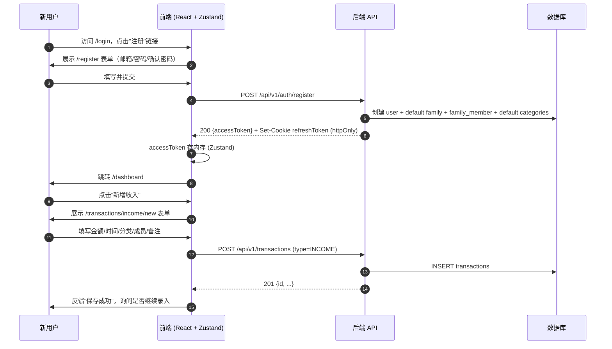

# scn-001 注册登录并录入首笔收入

> **North-star 场景**：新用户从第一次进入站点到在数据库里留下第一条属于他家庭的收入记录。跨 TH-02（认证授权）+ TH-01（财务记录管理），是用户感知产品价值的最短闭环。
>
> 对应 [UJ-01 首次上手](../../business/user-journeys/UJ-01-first-time-setup.md) 的阶段 2~4。

---

## Actors

- **Primary**: 新用户（未注册）
- **Secondary**: 系统（自动初始化家庭 / 默认分类 / 成员关系）

## Preconditions

- 浏览器能访问前端地址
- 后端 API 可用（`/api/v1/auth/*`、`/api/v1/transactions`）
- 限流中间件已启用（IP / 邮箱级别）
- 邮箱服务可用（用于异步发送注册确认通知）

## Trigger

用户在未登录状态访问任意路径——`/` / `*` 统一 `Navigate` 到 `/login`，本场景从用户点击"注册"起算。

---

## Main path

```mermaid
sequenceDiagram
    autonumber
    participant U as 新用户
    participant FE as 前端 (React + Zustand)
    participant API as 后端 API
    participant DB as 数据库

    U->>FE: 访问 /login，点击"注册"链接
    FE->>U: 展示 /register 表单（邮箱/密码/确认密码）
    U->>FE: 填写并提交
    FE->>API: POST /api/v1/auth/register
    API->>DB: 创建 user + default family + family_member + default categories
    API-->>FE: 200 {accessToken} + Set-Cookie refreshToken (httpOnly)
    FE->>FE: accessToken 存内存 (Zustand)
    FE->>U: 跳转 /dashboard
    U->>FE: 点击"新增收入"
    FE->>U: 展示 /transactions/income/new 表单
    U->>FE: 填写金额/时间/分类/成员/备注
    FE->>API: POST /api/v1/transactions (type=INCOME)
    API->>DB: INSERT transactions
    API-->>FE: 201 {id, ...}
    FE->>U: 反馈"保存成功"，询问是否继续录入
```

**价值兑现点**：步骤 15（DB 留下第一条 INCOME 记录）——用户完成从"陌生人"到"拥有家庭财务数据"的身份转变。

---

## Journey stages

| 阶段 | 主要任务 | 关键触点 | 优化建议 |
|------|----------|----------|---------|
| **账户注册** | 填写邮箱/密码 → 提交 | `/register`、密码强度提示 | 社交登录、表单自动填充、实时校验 |
| **家庭初始化** | 系统自动完成 | 默认家庭名 / 默认分类 | 首次登录提示"你的家庭已创建" |
| **首次价值兑现** | 录入第一笔收入 | `/dashboard` 空态引导 → CTA → 表单 | 仪表盘空态组件 + Onboarding Tooltip；表单支持键盘导航与字段级错误 |
| **网络异常兜底** | 超时/离线/限流 | 提交按钮 / Toast | 按钮 loading 态、错误行内反馈、429 友好提示 |

---

## Business rules / 关键约束

- **原子性**：register 端点在单个数据库事务中执行（`READ COMMITTED` 以上隔离级别）。user + family + family_member + categories 一次落库，任一失败整体回滚，避免产生孤儿记录
- **幂等性**：注册请求使用邮箱作为幂等键，5 分钟内重复提交返回同一结果，防止网络抖动导致重复创建账户
- **限流防护**：
  - `/api/v1/auth/register`：每 IP 每小时 ≤ 20 次，每邮箱每天 ≤ 5 次
  - `/api/v1/auth/login`：每 IP 每小时 ≤ 60 次，每账户连续失败 5 次后锁定 15 分钟
  - `/api/v1/auth/refresh`：每 refreshToken 每小时 ≤ 10 次
- **密码策略**：最小长度 8 位，拒绝常见密码（Top 100k），使用 Argon2id 哈希并 per-user 随机 salt
- **令牌分工**：
  - accessToken 存内存（Zustand），有效期 15 分钟，页面刷新后通过 `/api/v1/auth/refresh` 静默续期
  - refreshToken 通过 `Set-Cookie` 下发，标记 `httpOnly; Secure; SameSite=Lax; Path=/api/v1/auth/refresh; Max-Age=7d`
  - 每次刷新后下发新 refreshToken 并使旧 Token 失效（Refresh Token Rotation），防止重放攻击
- **金额约束**：首笔收入 `amount > 0`、`date ≤ now`；分类必须属于该用户的 family（后端校验）
- **加载与防重**：表单提交后按钮进入 loading 状态并禁用，API 返回前禁止重复提交；网络超时阈值 10 秒

---

## Alternative / Error paths

| 分支点 | 场景 | 期望行为 |
|--------|------|----------|
| 步骤 4 | 邮箱已占用 | 200 / 400（产品决策后统一），前端统一提示"如果该邮箱可用，我们已发送确认邮件"；不得暴露邮箱是否已注册 |
| 步骤 5 | 家庭/分类初始化失败 | 500 + 事务回滚；前端兜底提示"注册失败，请重试"；用户可再次提交同一邮箱 |
| 步骤 8 后 | 用户关闭页面，下次返回 | 应用初始化时调用 `/api/v1/auth/refresh`；成功则恢复登录态并跳转原目标页，失败回 `/login` |
| 步骤 12 | 金额为 0 / 负数 / 未来日期 | 400，前端行内高亮字段并保留用户输入 |
| 步骤 13 | API 可达但 DB 故障 | 5xx + 前端"保存失败"；表单数据保留在 React state，不落地 localStorage（避免敏感信息残留） |
| 步骤 3 / 11 | 网络超时或离线 | 前端提示"网络异常，请检查连接"；提交按钮恢复可点状态 |
| 步骤 4 / 12 | 触发限流 | 429，前端提示"操作过于频繁，请稍后重试" |

---

## Privacy & Compliance

- **数据最小化**：注册仅收集邮箱和密码，不强制收集手机号、真实姓名等 PII
- **用户同意**：`/register` 表单需包含《用户协议》与《隐私政策》勾选框，未勾选无法提交
- **账户删除**：用户可在设置中申请删除账户，系统需在 30 天内清除个人标识数据（审计日志脱敏保留）
- **敏感日志**：禁止在前端 console、服务端 info 日志中输出 accessToken、原始密码或完整 refreshToken

## Observability

- **关键业务指标**：
  - 注册转化率：访问 `/login` → 完成注册（步骤 4 成功）
  - 首笔收入录入率：注册成功 → 24h 内完成步骤 15
  - 各环节漏斗 dropout 率
- **技术监控**：
  - `/api/v1/auth/register` 与 `/api/v1/transactions` 的 P99 延迟、4xx/5xx 比例
  - refresh 失败率、限流触发次数
- **审计日志**：记录注册行为（时间、IP、UA、结果），保留 180 天；不记录密码明文

## 关联 Features

- `ft-003-auth`：步骤 1-8（注册 + 令牌分发）
- `ft-001-create`：步骤 9-15（首笔录入）

未覆盖且将来拆分的能力：

- 邮箱验证 / 忘记密码（ft-003 "不包含"）
- 家庭邀请第二个成员（未来 scenario）

---

## 维护触发器

改动下列任一项时，PR 需回看本 scenario 是否仍然准确：

- `/api/v1/auth/register` 的请求/响应契约（含 Set-Cookie 策略）
- 前端路由 `/login` `/register` `/dashboard` `/transactions/income/new` 的挂载位置或跳转链
- 注册时的默认资源初始化（家庭 / 分类 / 成员）——增减项都要更新步骤 5
- `/api/v1/transactions` POST 契约（type=INCOME 分支）
- accessToken / refreshToken 存储位置策略
- 限流规则（IP / 邮箱 / 账户级别阈值）
- 密码策略（长度、常见密码检查、哈希算法）
- 隐私政策勾选与账户删除入口
- 审计日志字段与保留周期

Reviewer 在 PR 评审中检查——无 hook，靠评审纪律。
