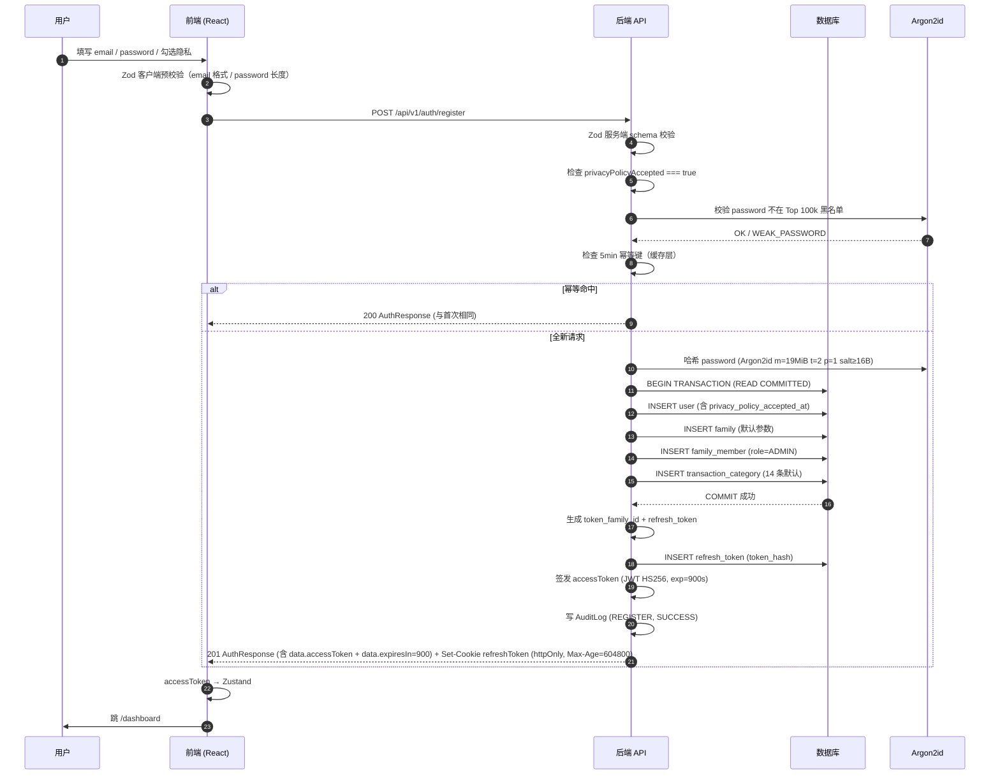
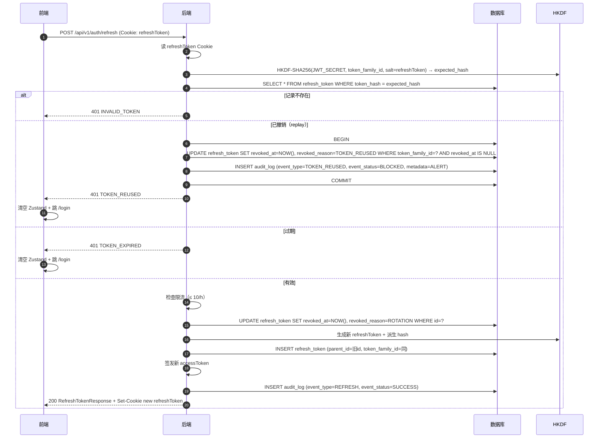
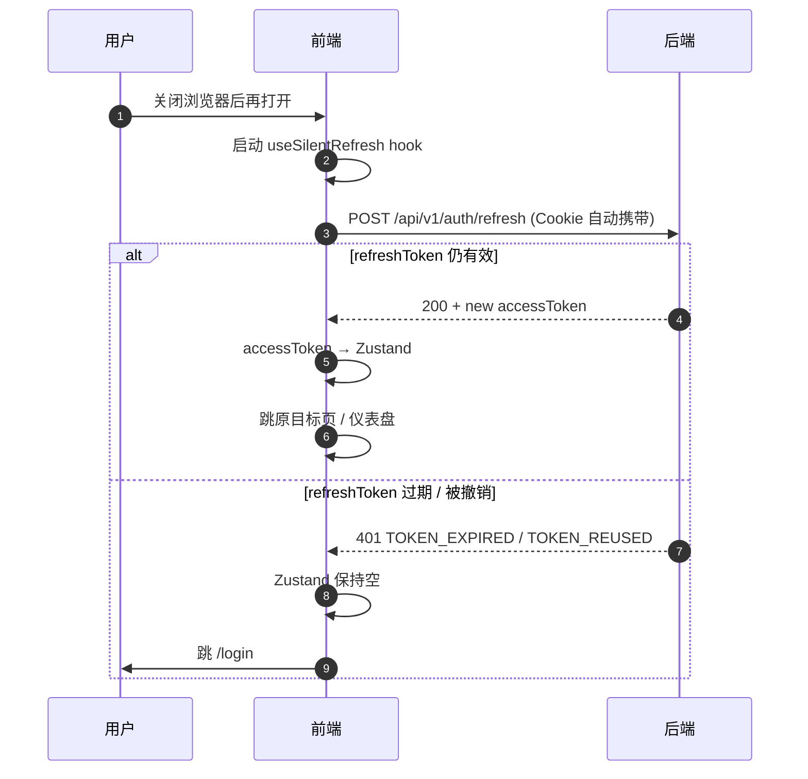

# ft-001 用户注册与家庭创建 — 设计详设

> 对应 feature：[feature.md](./feature.md)
> 设计契约：[scn-001](../../architecture/scenarios/scn-001-first-time-setup.md)（步骤 1~8 + Alternative 步骤 8 后"刷新恢复会话"）
> API 契约：[openapi.yaml](../../api/openapi.yaml)

---

## 1. 组件分层

### 1.1 后端

```
backend/src/
├── app.ts                                # Express 实例 + 中间件挂载
├── server.ts                             # 启动监听
├── config/
│   └── env.ts                            # JWT_SECRET / DB_URL / RATE_LIMIT_* 等环境变量
├── shared/
│   ├── crypto/
│   │   ├── passwordHasher.ts             # Argon2id 哈希与验证
│   │   ├── hkdf.ts                       # HKDF-SHA256 派生
│   │   └── tokenGenerator.ts             # 256-bit 安全随机数
│   ├── jwt/
│   │   └── jwtSigner.ts                  # accessToken 签发与校验
│   ├── middleware/
│   │   ├── errorHandler.ts               # 统一错误响应（按 engineering skill 错误格式）
│   │   ├── requestValidator.ts           # Zod schema 校验中间件
│   │   ├── rateLimiter.ts                # 三级限流（IP / email / token）
│   │   ├── authGuard.ts                  # 校验 accessToken
│   │   └── auditLogger.ts                # 写 AuditLog
│   └── errors/
│       └── AppError.ts                   # 业务错误类 + HTTP 状态映射
├── modules/
│   └── auth/
│       ├── auth.controller.ts            # 4 个端点（register / login / refresh / logout）
│       ├── auth.service.ts               # 业务编排
│       ├── auth.schemas.ts               # Zod schema（运行时校验 + 类型推导）
│       ├── refreshToken.repository.ts    # RefreshToken CRUD
│       ├── passwordBlacklist.ts          # 基础 Top 100k 黑名单（启动时加载 .txt）
│       └── usernameGenerator.ts          # email 前缀派生 + 重名后缀
├── modules/
│   └── family/
│       ├── family.service.ts             # 默认家庭创建 + 默认分类初始化
│       └── defaultCategories.ts          # INCOME/EXPENSE 预置分类数据
├── modules/
│   └── user/
│       └── user.repository.ts            # User CRUD（按 email / id 查找）
└── modules/
    └── audit/
        └── audit.repository.ts           # AuditLog append-only 写入
```

**Controller / Service 分层**（按 engineering skill 规范）：

| 层 | 职责 |
|----|------|
| **Controller** | 解析 HTTP 参数、Zod 校验、调用 Service、错误转 HTTP 状态码 |
| **Service** | 业务规则、数据访问、事务控制、跨 Service 编排 |

### 1.2 前端

```
frontend/web/src/
├── services/
│   ├── httpClient.ts                     # axios 实例 + 请求/响应拦截
│   └── authService.ts                    # register / login / refresh / logout 调用
├── features/
│   └── auth/
│       ├── pages/
│       │   ├── RegisterPage.tsx
│       │   ├── LoginPage.tsx
│       │   └── PrivacyPolicyPage.tsx
│       ├── components/
│       │   ├── AuthForm.tsx              # 共享表单布局（register/login 复用）
│       │   ├── PasswordStrength.tsx
│       │   ├── PrivacyConsentCheckbox.tsx
│       │   └── AuthErrorBanner.tsx
│       └── hooks/
│           ├── useAuth.ts                # 登录态、accessToken 内存 store
│           └── useSilentRefresh.ts       # 应用启动时调用 /auth/refresh
├── components/                            # 跨 feature 复用
│   ├── FormField.tsx
│   ├── Button.tsx
│   └── Toast.tsx
├── store/
│   └── authStore.ts                      # Zustand：accessToken（仅内存）+ user
├── router/
│   └── ProtectedRoute.tsx                # 未登录跳 /login
└── lib/
    └── constants/api.ts                  # 端点路径常量（与 openapi.yaml 对齐）
```

**关键设计决策**：

- **accessToken 存 Zustand 内存**（不存 localStorage / sessionStorage）：防止 XSS 窃取
- **refreshToken 由浏览器自动管理**（httpOnly Cookie）：前端 JS 不可读
- **404 / 401 拦截器**：401 → 清空 Zustand + 跳 `/login`；refresh 接口本身的 401 不跳（仅清除状态）
- **rememberMe 复选框（MVP 隐藏）**：当前 US-002 AC5 明确 rememberMe=true / false 均下发相同 7d Max-Age 的 Cookie，若 UI 展示该复选框将给用户"勾选/不勾选无差别"的错觉。AuthForm 登录场景在 MVP 阶段**隐藏** rememberMe 复选框，字段保留为后续差异化（如 false 时改 sessionToken 或缩短 Max-Age）留接口（2026-06-04 v4 备注）

---

## 2. API Inventory

> 完整契约见 [openapi.yaml](../../api/openapi.yaml)。本节标注 ft-001 关键实现要点。

### 2.1 端点清单

| 端点 | 方法 | Controller | Service | 限流 | 关键安全机制 |
|------|------|-----------|---------|------|------------|
| `/api/v1/auth/register` | POST | auth.controller.register | auth.service.register | IP 20/h + email 5/day | Argon2id 哈希、事务原子性、幂等键、隐私校验 |
| `/api/v1/auth/login` | POST | auth.controller.login | auth.service.login | IP 60/h + 5 失败锁 15min | 密码验证、失败计数、账户锁定 |
| `/api/v1/auth/refresh` | POST | auth.controller.refresh | auth.service.refresh | refreshToken 10/h | HKDF 派生、Rotation、family 重放检测 |
| `/api/v1/auth/logout` | POST | auth.controller.logout | auth.service.logout | 无（已认证） | 撤销 token family、清 Cookie |

### 2.2 错误码补充

v3 在 openapi.yaml 中**直接落地**了以下错误码（不再延后）：

| 错误码 | HTTP | 触发场景 | 错误消息模板 |
|--------|------|----------|------------|
| `WEAK_PASSWORD` | 400 | 密码长度 < 8 或命中 Top 100k 黑名单 | "密码强度不足，请使用更复杂的密码" |
| `INVALID_PRIVACY_CONSENT` | 400 | privacyPolicyAccepted 非 true | "请勾选《用户协议》与《隐私政策》" |
| `EMAIL_ALREADY_EXISTS` | 409 | 5 分钟幂等窗口外的邮箱重复 | "该邮箱已注册" |
| `TOKEN_REUSED` | 401 | 已被撤销的 refreshToken 重放 | "会话已失效，请重新登录" |
| `RATE_LIMIT_EXCEEDED` | 429 | IP / email / token 任一级触发 | "操作过于频繁，请稍后重试" |
| `ACCOUNT_LOCKED` | 423 | 连续 5 次失败 | "账户已锁定，请 15 分钟后重试" |

---

## 3. 数据模型变更

> 完整定义见 [data-model.md](../../data/data-model.md)。本节标注 ft-001 关键字段。

### 3.1 新增 / 修改表

| 表 | 变更类型 | 关键字段 |
|----|----------|----------|
| `User` | 修改 | + `privacy_policy_accepted_at` / `failed_login_count` / `locked_until`；`password_hash` 改用 Argon2id |
| `Family` | 新建 | name / currency / timezone / language / status |
| `FamilyMember` | 新建 | user_id / family_id / role=ADMIN / status=active |
| `RefreshToken` | 新建 | user_id / token_family_id / parent_id / token_hash / expires_at / revoked_at / revoked_reason |
| `AuditLog` | 新建 | user_id / event_type / event_status / ip / ua / metadata / created_at |
| `TransactionCategory` | 新建（默认数据） | INCOME 6 条（工资 / 奖金 / 投资收益 / 兼职 / 礼金 / 其他）+ EXPENSE 8 条（餐饮 / 交通 / 居家 / 医疗 / 教育 / 娱乐 / 购物 / 其他） |

### 3.2 关键字段约束

| 字段 | 类型 | 约束 | 说明 |
|------|------|------|------|
| `User.email` | VARCHAR(100) | UNIQUE, NOT NULL, 邮箱正则 | 登录身份 |
| `User.username` | VARCHAR(20) | UNIQUE, NOT NULL, `^[a-zA-Z0-9_]+$` | 注册时派生 |
| `User.password_hash` | TEXT | NOT NULL, Argon2id 完整输出 | 包含算法 + 参数 + salt + hash |
| `RefreshToken.token_hash` | CHAR(64) | UNIQUE, NOT NULL, SHA-256 hex | 仅存哈希，DB 泄露不致 token 泄露 |
| `RefreshToken.token_family_id` | UUID | NOT NULL, INDEX | 重放检测的隔离单元 |
| `AuditLog.created_at` | TIMESTAMP | DEFAULT NOW(), INDEX | 180 天保留 |

### 3.3 索引

```sql
-- User
CREATE UNIQUE INDEX idx_user_email ON "User"(email);
CREATE UNIQUE INDEX idx_user_username ON "User"(username);

-- RefreshToken
CREATE INDEX idx_refresh_token_hash ON "RefreshToken"(token_hash);
CREATE INDEX idx_refresh_token_family ON "RefreshToken"(token_family_id);
CREATE INDEX idx_refresh_user_active ON "RefreshToken"(user_id, expires_at) WHERE revoked_at IS NULL;

-- AuditLog
CREATE INDEX idx_audit_user_time ON "AuditLog"(user_id, created_at DESC);
CREATE INDEX idx_audit_event_time ON "AuditLog"(event_type, created_at DESC);
```

---

## 4. 关键交互（Mermaid 序列图）

### 4.1 注册流程



### 4.2 刷新令牌（Rotation + 重放检测）



### 4.3 页面刷新恢复会话



---

## 5. 安全基线

> 完整 checklist 见 [engineering skill §安全基线](../../.claude/skills/engineering/SKILL.md#安全基线)。本节聚焦 ft-001 落地项。

### 5.1 密码

- [x] **Argon2id 哈希**：m=19MiB, t=2, p=1, salt≥16B（per-user 随机），hash 输出格式：$argon2id$v=19$m=19456,t=2,p=1$salt$hash
- [x] **Top 100k 密码黑名单**：ft 内必做，基础实现。启动时一次性加载 `backend/src/modules/auth/top100k-passwords.txt` 到 `Set<string>`，注册时 O(1) 查询；命中返回 400 WEAK_PASSWORD
- [x] **最小长度 8**：由 Zod schema `password.min(8).max(128)` 强制
- [x] **禁止明文日志**：password 字段在 controller 层立即丢弃，不进入 service / log

### 5.2 令牌

- [x] **accessToken**：JWT HS256，payload `{ sub: userId, familyId, iat, exp }`，exp=900s（15min），secret 来自 `process.env.JWT_SECRET`（≥ 256 bit，启动时校验长度）
- [x] **refreshToken**：256-bit 随机数（`crypto.randomBytes(32).toString('base64url')`），DB 存 SHA-256 哈希
- [x] **Refresh Token Rotation**：每次刷新颁发新 token 并撤销旧 token
- [x] **Family 重放检测**：撤销 token 时同步撤销同 family 所有未到期 token，写 ALERT 审计
- [x] **HKDF-SHA256 派生**：DB 存的 token_hash = HKDF(JWT_SECRET, token_family_id, info=base64url(token))，即使 DB 泄露也不直接暴露 token
- [x] **Cookie 属性**：`httpOnly; Secure; SameSite=Lax; Path=/api/v1/auth; Max-Age=604800`

### 5.3 限流（3 级）

| 级别 | 端点 | 规则 | 实现 |
|------|------|------|------|
| IP 维度 | `/api/v1/auth/register` | 20 / 小时 | `express-rate-limit` + IP key |
| 邮箱维度 | `/api/v1/auth/register` | 5 / 天 | 自定义 store（DB 或内存 Map，key=email） |
| IP 维度 | `/api/v1/auth/login` | 60 / 小时 | `express-rate-limit` + IP key |
| 账户维度 | `/api/v1/auth/login` | 5 失败 → 锁 15min | DB 字段 `failed_login_count` / `locked_until` |
| Token 维度 | `/api/v1/auth/refresh` | 10 / 小时 | 自定义 store，key=token_hash |

**MVP 限制**：限流 store 暂用进程内存 Map（`Map<key, {count, resetAt}>`），**不**支持跨进程共享。生产环境需迁移到 Redis（**ft 外延后：td-002**）。

**423 ACCOUNT_LOCKED 响应约定**：locked_until 通过 `error.details[]` 承载，格式为 `{ field: "lockedUntil", message: "账户锁定到期时间（ISO8601）", value: "<ISO8601 时间戳>" }`。前端据此展示「请于 X 时间后重试」并禁用提交按钮至该时刻；不通过 HTTP `Retry-After` header、不通过自定义顶级字段——统一走 `details[]` 以保持跨端契约一致（2026-06-04 v4 明确）

### 5.4 审计

- [x] **记录事件**：REGISTER / LOGIN_SUCCESS / LOGIN_FAIL / LOGOUT / REFRESH / TOKEN_REUSED / PASSWORD_CHANGE
- [x] **记录字段**：user_id, event_type, event_status, ip, ua, metadata, created_at
- [x] **不记录敏感**：accessToken / refreshToken / 原始密码 / 密码哈希
- [x] **保留 180 天**：到期后由定时 job 物理删除（**ft 外延后：td-003**）

### 5.5 隐私合规

- [x] **数据最小化**：注册仅收 email + password + privacyPolicyAccepted（phone 仍为可选）
- [x] **用户协议 + 隐私政策勾选**：未勾选 / false / null / 缺失均拒绝
- [x] **协议版本追踪**：`privacy_policy_accepted_at` 时间戳，可证明接受时点
- [x] **协议 URL 页面**：前端 `/legal/terms` / `/legal/privacy` 静态页面（**ft 外延后：td-001**）
- [x] **已知 trade-off（2026-06-04 v4 备注）**：MVP 5min 幂等窗口外返回 `409 EMAIL_ALREADY_EXISTS`，会明确告诉攻击者目标邮箱已注册，与 scn-001 Alternative 步骤 4"不暴露邮箱是否已注册"存在偏差。MVP 阶段主动接受此 trade-off（无邮箱验证无法走"已发送确认邮件"友好响应，彻底符合需引入异步邮件 + 响应均匀化，估算 1-2 天超出 ft-001 范围）；待后续引入邮箱验证 epic 统一为均匀响应

### 5.6 输入校验

- [x] **Zod schema**：所有入口用 Zod 校验
- [x] **参数化查询**：DB 访问统一走 user / refreshToken 等 repository，禁止字符串拼接 SQL
- [x] **错误响应脱敏**：统一返回业务错误码 + message，**不**暴露 DB 错误堆栈、SQL 语句、env 变量
- [x] **CORS**：后端 CORS 配置限制来源（**ft 外延后：td-004**，MVP 用 `cors({ origin: env.ALLOWED_ORIGINS })`）。**启动 env 加载阶段对 `ALLOWED_ORIGINS` 做非空 + 形如 `https?://host[:port]` 列表的校验，缺值/格式不合法时进程退出（fail-fast），与 `JWT_SECRET` 同级严格度**，避免运行时因 origin 缺失或误设 `*` 产生"接口全失败"或安全裸奔（2026-06-04 v4 明确）

### 5.7 网络与超时

- [x] **请求超时 10s**：前端 axios 默认 `timeout: 10000`，超时后统一提示"网络异常，请检查连接"
- [x] **后端慢请求监控**：注册 / 登录 / 刷新 > 2s 触发 WARN 日志
- [x] **前端按钮防重**：提交后按钮 loading + disabled，响应回来前禁止重复提交

---

## 6. 必填字段初始化

### 6.1 默认家庭（注册事务内）

```typescript
const defaultFamily = {
  name: '我的家庭',
  currency: 'CNY',
  timezone: 'Asia/Shanghai',
  language: 'zh-CN',
  status: 'active',
};

const defaultMember = {
  role: 'ADMIN',   // 注册者即家庭管理员
  status: 'active',
};
```

### 6.2 默认分类（注册事务内）

**INCOME 收入（6 条）**：

| name | type | sort_order | system_default |
|------|------|------------|----------------|
| 工资收入 | INCOME | 1 | true |
| 奖金 | INCOME | 2 | true |
| 投资收益 | INCOME | 3 | true |
| 兼职收入 | INCOME | 4 | true |
| 礼金 | INCOME | 5 | true |
| 其他收入 | INCOME | 6 | true |

**EXPENSE 支出（8 条）**：

| name | type | sort_order | system_default |
|------|------|------------|----------------|
| 餐饮 | EXPENSE | 1 | true |
| 交通 | EXPENSE | 2 | true |
| 居家 | EXPENSE | 3 | true |
| 医疗 | EXPENSE | 4 | true |
| 教育 | EXPENSE | 5 | true |
| 娱乐 | EXPENSE | 6 | true |
| 购物 | EXPENSE | 7 | true |
| 其他支出 | EXPENSE | 8 | true |

> 14 条默认分类写在 `backend/src/modules/family/defaultCategories.ts`，事务内循环插入。后续 ft-002（记录支出）直接复用此初始化结果。

---

## 7. 可观测性

### 7.1 关键业务指标

| 指标 | 计算 | 来源 |
|------|------|------|
| 注册转化率 | 完成注册的请求数 / 触达 `/register` 的会话数 | 前端埋点 + 后端 AuditLog |
| 注册 → 首笔记录率 | 24h 内完成 ft-002 写入的用户数 / 注册成功用户数 | AuditLog + Transaction 表 |
| 登录成功率 | LOGIN_SUCCESS / (LOGIN_SUCCESS + LOGIN_FAIL) | AuditLog |
| refresh 失败率 | TOKEN_REUSED + TOKEN_EXPIRED / 总 refresh 请求 | AuditLog + API 日志 |

### 7.2 技术监控

| 指标 | 阈值告警 | 来源 |
|------|----------|------|
| `/api/v1/auth/register` P99 延迟 | > 2s | API 访问日志（**MVP** stdout；**未来** OTel） |
| `/api/v1/auth/login` P99 延迟 | > 1s | 同上 |
| `/api/v1/auth/refresh` P99 延迟 | > 500ms | 同上 |
| 4xx / 5xx 比例 | 4xx > 5%、5xx > 0.5% | 同上 |
| 限流触发次数 | > 100/min 单 IP | Rate Limiter 计数 |
| Argon2id 哈希单次耗时 | > 100ms | 自定义 timing wrapper |
| TOKEN_REUSED 触发 | 单用户 1 次 / 5min | AuditLog ALERT 级别 |

**可观测性栈**：MVP 阶段写 stdout + 文件（`backend/logs/*.log`）；未来接入 OTel + Prometheus（**ft 外延后：td-005**）。

### 7.3 告警规则（MVP 简化）

| 事件 | 响应 |
|------|------|
| TOKEN_REUSED 触发 | stderr 红色日志 + 写 ALERT 审计；不通知用户（避免泄露） |
| 5xx 错误率 > 1% | stderr 红色日志；开发期人工监控 |
| 单 IP 限流触发 > 50/h | stderr WARN 日志；为后续风控提供线索 |

---

## 8. 回滚方案

### 8.1 部署回滚（MVP 单实例）

- 部署前打 git tag `ft-001-v3-{timestamp}`；CI 失败 / P0 不通过时 `git revert` 主分支 commit
- DB 迁移：使用一次性脚本（`backend/scripts/migrate-001-auth.sql`），回滚时反向脚本（`backend/scripts/rollback-001-auth.sql`）删除新增表

### 8.2 数据回滚（最坏情况）

| 场景 | 影响 | 回滚操作 |
|------|------|----------|
| 哈希参数不兼容 | 用户无法登录 | 保留旧 password_hash 字段 30 天，过渡期支持 bcrypt + Argon2id 双验 |
| refreshToken Rotation bug | 用户被强制重新登录 | 临时禁用 Rotation：保留旧 token 不撤销（24h 监控期） |
| family replay 误触发 | 用户被强制登出 | 关闭 family 级联撤销，仅撤销单 token（4h 监控期） |
| 默认分类不匹配业务 | ft-002 使用时才发现 | 修补 defaultCategories.ts，已注册用户通过 patch 脚本追加分类 |

### 8.3 前端回滚

- 旧版本前端 accessToken 在内存中，与新后端兼容（JWT secret 不变）
- 旧版本前端不调用新接口时无影响
- 新接口（如新增 `/api/v1/auth/me`）缺失时旧前端兜底为空

---

## 9. Scenario 影响

本 ft 严格遵循 [scn-001](../../architecture/scenarios/scn-001-first-time-setup.md) 的步骤 1~8 + Alternative 步骤 8 后"刷新恢复会话"分支。**未修改 scn-001 任何字段**——所有 ft 决策均在 scn-001 已有约束范围内收敛。

| scn-001 要素 | 本 ft 实现 | 偏差 |
|--------------|------------|------|
| 步骤 4 注册 | 严格按 scn-001 字段 + privacyPolicyAccepted | 无 |
| 步骤 5 家庭/分类初始化 | 14 条默认分类、family 字段按 scn-001 隐含要求 | 无 |
| 限流规则 | 三级限流（IP / email / account / token），数值与 scn-001 完全一致 | 无 |
| 密码策略 | Argon2id + Top 100k 黑名单 + 长度 8-128 | scn-001 未指定哈希算法；B1-a 用户决策补充 Argon2id |
| 令牌分工 | accessToken 15min 内存 + refreshToken 7d httpOnly Cookie | 无 |
| Rotation + family 重放 | HKDF 派生 + family 级联撤销 | scn-001 提到机制，本 ft 落地 HKDF 具体算法 |
| 隐私勾选 | privacyPolicyAccepted 必填 | 无 |
| 审计 180d | AuditLog 表 + 保留策略文档化 | 无 |
| 步骤 8 后"刷新恢复" | useSilentRefresh hook + /auth/refresh | 无 |

---

## 10. 测试覆盖要求

> 详细 rubric 见 [test-design-rubric](../../.claude/skills/test-design-rubric/SKILL.md)。本节聚焦 ft-001 关键测试点。

### 10.1 P0（必须 100% 覆盖）

| 类别 | 测试点 |
|------|--------|
| 注册 | 必填校验、邮箱格式、密码强度、隐私勾选、幂等、事务原子性、username 派生 |
| 登录 | 凭据校验、连续失败锁定、rememberMe 行为、Cookie 属性 |
| 刷新 | 正常续期、过期拒绝、重放检测（撤销 family）、限流 |
| 登出 | 撤销 refreshToken、清 Cookie、撤销后无法 refresh |

### 10.2 P1

- 边界：username 派生时邮箱前缀包含特殊字符（如 `+` / `.`）
- 边界：注册时事务部分失败（如 family 创建失败）→ 整体回滚
- 并发：同一 email 并发注册（5min 内）→ 仅创建 1 个 user
- 安全：refreshToken Cookie 标记 `httpOnly`（前端 JS 不可读）

### 10.3 P2

- 国际化：邮箱后缀大写归一化
- 性能：注册事务 14 条分类插入耗时 < 200ms
- 可观测性：AuditLog 字段完整、无敏感信息

---

## 11. 附录

### 11.1 环境变量

| 变量 | 必填 | 说明 |
|------|------|------|
| `JWT_SECRET` | 是 | accessToken 签名密钥，≥ 256 bit，启动时校验 |
| `DATABASE_URL` | 是 | PostgreSQL 连接串 |
| `ALLOWED_ORIGINS` | 是 | CORS 白名单，逗号分隔，**启动时校验非空 + 形如 `https?://host[:port]` 列表，缺值/格式不合法时进程退出（fail-fast）** |
| `COOKIE_SECURE` | 否 | 生产必须 `true`，开发可 `false` |
| `RATE_LIMIT_REGISTER_IP` | 否 | 默认 20/h |
| `RATE_LIMIT_REGISTER_EMAIL` | 否 | 默认 5/day |
| `RATE_LIMIT_LOGIN_IP` | 否 | 默认 60/h |
| `RATE_LIMIT_REFRESH_TOKEN` | 否 | 默认 10/h |
| `ACCOUNT_LOCK_THRESHOLD` | 否 | 默认 5 |
| `ACCOUNT_LOCK_DURATION_MIN` | 否 | 默认 15 |

### 11.2 依赖（package.json 增量）

**后端**：

```json
{
  "dependencies": {
    "argon2": "^0.40.0",
    "jsonwebtoken": "^9.0.0",
    "express-rate-limit": "^7.0.0",
    "zod": "^4.0.0",
    "uuid": "^9.0.0"
  }
}
```

**前端**：

```json
{
  "dependencies": {
    "zustand": "^4.5.0",
    "axios": "^1.7.0",
    "react-hook-form": "^7.50.0",
    "zod": "^4.0.0"
  }
}
```

### 11.3 关联文档

- [feature.md](./feature.md) — 4 US / 24 AC
- [scn-001](../../architecture/scenarios/scn-001-first-time-setup.md) — North-star 场景
- [openapi.yaml](../../api/openapi.yaml) — API 契约
- [data-model.md](../../data/data-model.md) — 数据模型
- [engineering skill](../../.claude/skills/engineering/SKILL.md) — 编码规范
- [ADR-001](../../decisions/ADR-001-use-uuid.md) — UUID 标识
- [ADR-002](../../decisions/ADR-002-soft-delete.md) — 软删除（本 ft 内的 RefreshToken 物理删除为策略例外）
