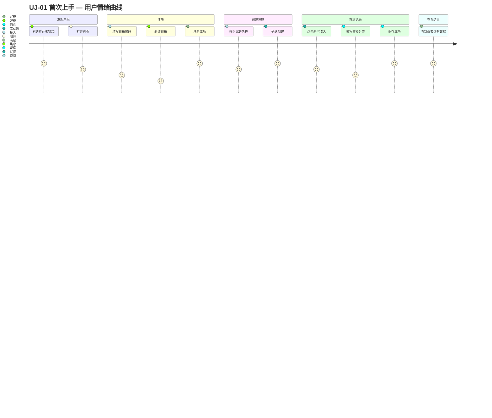

# UJ-01 首次上手

> **目标**：让新用户在 3 分钟内完成注册并录入第一笔收入，建立对产品的基本信任。

## 用户画像

- **主要**：[PERSONA-01](../../user-personas.md#persona-01-家庭管理员) 新手家长（第一次使用家庭财务工具）
- **次要**：[PERSONA-02](../../user-personas.md#persona-02-技术爱好者) 技术爱好者（愿意探索功能）

## 旅程阶段

### 阶段 1：发现产品

用户通过朋友推荐、应用商店或搜索引擎了解到 FFP。

- **触点**：移动端 / Web 首页
- **关键决策**：是否值得注册？
- **产品目标**：首页在 5 秒内传达核心价值（"轻松管理家庭财务"）

### 阶段 2：注册

用户决定尝试，开始注册流程。

- **触点**：注册表单（邮箱 / 密码 / 确认密码）
- **关键决策**：是否愿意提供邮箱？
- **friction**：邮箱验证可能中断流程
- **产品目标**：最小化注册步骤，提供清晰的隐私说明

### 阶段 3：创建家庭

注册成功后，系统自动引导创建家庭。

- **触点**：家庭创建向导
- **关键决策**：家庭名称怎么取？
- **产品目标**：提供默认名称（"我的家庭"），允许跳过稍后设置

### 阶段 4：首次记录

系统引导用户录入第一笔收入，建立"产品有用"的认知。

- **触点**：收入录入表单
- **关键决策**：是否愿意花时间录入？
- **friction**：分类体系陌生，不确定该选什么
- **产品目标**：预置常见分类（工资、奖金、理财收益），提供示例金额

### 阶段 5：查看结果

用户查看仪表盘，看到数据被可视化呈现。

- **触点**：仪表盘页面
- **关键决策**：这个产品值得长期使用吗？
- **产品目标**：即使只有一笔记录，也展示美观的图表和积极的反馈

## 涉及功能区域

| Theme | Epic | 说明 |
|-------|------|------|
| TH-02 认证与家庭权限 | epic-002 认证授权 | 注册、登录 |
| TH-02 认证与家庭权限 | epic-010 家庭成员管理 | 家庭创建 |
| TH-01 财务记录管理 | epic-001 收入记录管理 | 录入第一笔收入 |
| TH-04 数据分析与可视化 | epic-007 仪表盘 | 首次查看数据 |

## 痛点与机会

| 阶段 | 痛点 | 机会 |
|------|------|------|
| 注册 | 邮箱验证打断流程 | 支持社交登录 / 延迟验证 |
| 创建家庭 | 不知道家庭名称怎么取 | 智能建议 + 允许跳过 |
| 首次记录 | 分类不熟悉 | 预置常见分类 + 智能推荐 |
| 查看结果 | 只有一笔数据，图表空旷 | 展示示例数据的预览效果 |

## 涉及 Scenario

| Scenario | 说明 |
|----------|------|
| [scn-001](../../architecture/scenarios/scn-001-first-time-setup.md) | 注册 → 家庭初始化 → 首笔录入的完整系统交互 |

> UJ-01 的阶段 1（发现产品）和阶段 5（查看结果）暂无双 Feature 协作场景，不单独开 scenario。

## 关键指标

| 指标 | 目标值 | 说明 |
|------|--------|------|
| 注册转化率 | > 40% | 访问首页 → 完成注册 |
| 首次记录完成率 | > 60% | 注册成功 → 录入第一笔收入 |
| 3 日留存 | > 30% | 注册后 3 天内再次打开 |

## 相关旅程

- 衔接 [UJ-02 日常记账](UJ-02-daily-record.md)：首次上手后，用户进入日常使用阶段
