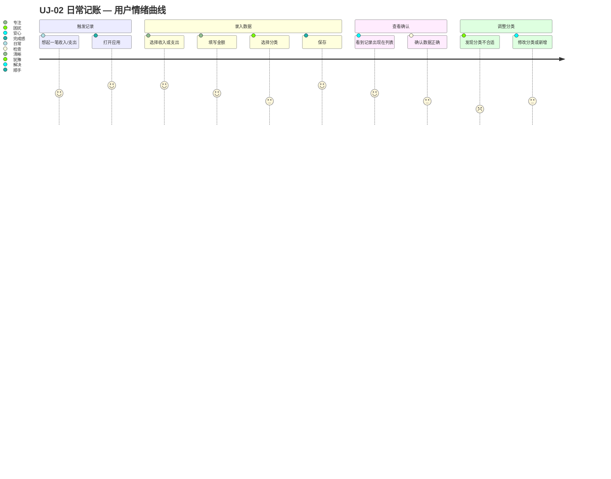

# UJ-02 日常记账

> **目标**：让用户以最低摩擦记录日常收支，养成持续记账的习惯。

## 用户画像

- **主要**：[PERSONA-01](../../user-personas.md#persona-01-家庭管理员) 家庭管理员（负责家庭财务的主要操作者）
- **次要**：[PERSONA-03](../../user-personas.md#persona-03-普通成员) 普通成员（偶尔记录个人支出）

## 旅程阶段

### 阶段 1：触发记录

用户在消费后或收到工资时，想到需要记录。

- **触点**：移动端 App / Web 快捷入口
- **高频场景**：
  - 收到工资后（每月 1~2 次）
  - 大额支出后（每周数次）
  - 日常小额支出（每天多次，但可能批量记录）
- **产品目标**：提供最快的录入路径（3 步内完成）

### 阶段 2：录入数据

用户填写记录表单。

- **核心字段**：金额、日期、分类、成员、备注
- **高频优化**：
  - 金额：支持计算器输入、常见金额快捷选择
  - 日期：默认今天，支持快速选择昨天/前天
  - 分类：记住上次选择，支持搜索
  - 成员：默认当前用户
- **产品目标**：减少每次录入的决策成本

### 阶段 3：查看确认

用户查看列表，确认记录无误。

- **触点**：收入/支出列表页
- **关注点**：金额是否正确、分类是否合适、日期是否对
- **产品目标**：列表清晰展示关键信息，支持快速筛选和搜索

### 阶段 4：调整分类

用户发现现有分类不够用或不准确，需要调整。

- **触点**：分类配置页面
- **场景**：
  - 新增二级分类（如"工资"下新增"年终奖"）
  - 修改分类名称
  - 发现某分类下有记录，无法删除
- **产品目标**：分类调整不影响已有记录，提供清晰的迁移指引

## 涉及功能区域

| Theme | Epic | 说明 |
|-------|------|------|
| TH-01 财务记录管理 | epic-001 收入记录管理 | 录入、查看、编辑、删除收入 |
| TH-01 财务记录管理 | epic-004 支出记录管理 | 录入、查看、编辑、删除支出 |
| TH-03 分类体系 | epic-003 分类管理 | 收入/支出分类配置 |

## 痛点与机会

| 阶段 | 痛点 | 机会 |
|------|------|------|
| 触发记录 | 忘记记录 | 定时提醒 / 银行导入 |
| 录入数据 | 分类选择耗时 | 智能分类推荐（基于金额/备注） |
| 录入数据 | 重复录入相似记录 | 模板功能 / 复制上条记录 |
| 查看确认 | 记录太多，查找困难 | 高级筛选 / 全文搜索 |
| 调整分类 | 删除分类时不知道影响 | 明确提示关联记录数 |

## 涉及 Scenario

| Scenario | 说明 |
|----------|------|
| — | UJ-02 各阶段均为单 Feature 交互，不单独开 scenario。阶段 3"查看确认"由 `ft-002-list/uc-001` 覆盖。 |

## 关键指标

| 指标 | 目标值 | 说明 |
|------|--------|------|
| 单次录入时间 | < 30 秒 | 从打开到保存完成 |
| 周活跃记账率 | > 50% | 每周至少记录一次的用户占比 |
| 分类使用覆盖率 | > 80% | 有记录覆盖的分类占比 |

## 相关旅程

- 前置：[UJ-01 首次上手](UJ-01-first-time-setup.md) — 首次录入的引导体验
- 衔接：[UJ-03 月度复盘](UJ-03-monthly-review.md) — 积累数据后的分析需求
