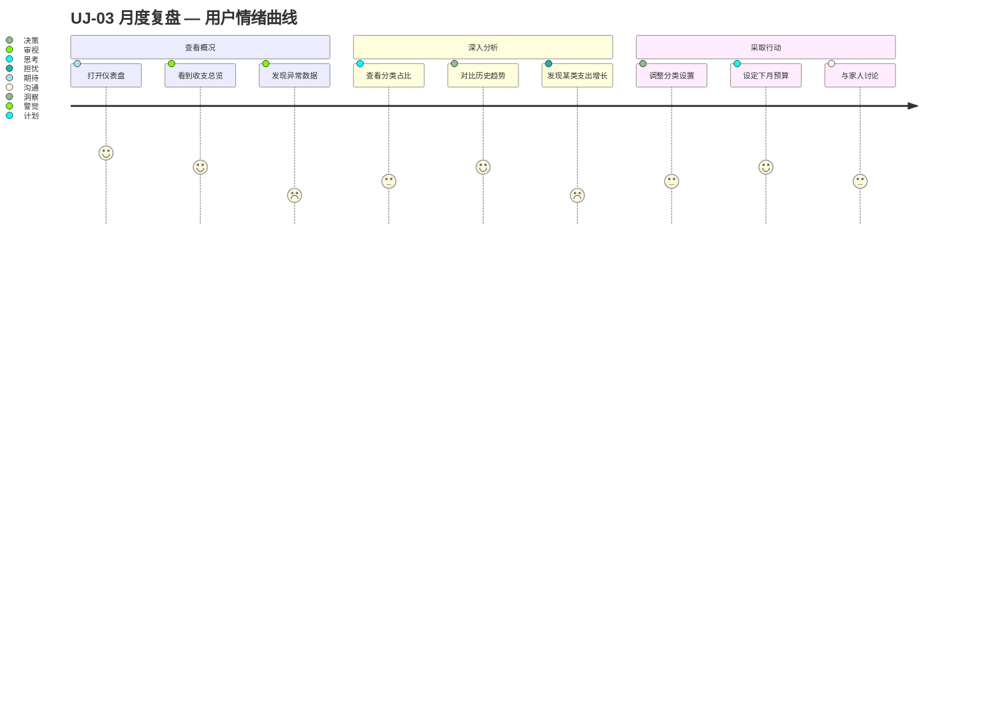

# UJ-03 月度复盘

> **目标**：帮助用户理解家庭财务状况，发现异常，支持决策。

## 用户画像

- **主要**：[PERSONA-01](../../user-personas.md#persona-01-家庭管理员) 家庭管理员（定期回顾财务状况）
- **次要**：[PERSONA-04](../../user-personas.md#persona-04-长期规划者) 长期规划者（关注趋势和资产配置）

## 旅程阶段

### 阶段 1：查看概况

用户在月初或月末打开仪表盘，查看家庭财务整体状况。

- **触点**：仪表盘页面
- **关注指标**：
  - 本月收入总额 vs 上月
  - 本月支出总额 vs 上月
  - 资产总额、负债总额
  - 收支差额（结余）
- **产品目标**：关键指标一目了然，异常数据突出显示

### 阶段 2：深入分析

用户发现某些数据值得关注，进一步 drill down。

- **触点**：分类占比图、趋势图、列表筛选
- **分析场景**：
  - "为什么这个月支出多了 20%？"
  - "哪个分类的支出增长最快？"
  - "近半年收入趋势如何？"
- **产品目标**：支持从概览到明细的多层下钻

### 阶段 3：采取行动

基于分析结果，用户决定调整财务行为。

- **触点**：分类配置、预算设置（未来版本）
- **行动类型**：
  - 调整分类体系（新增/合并分类）
  - 修正错误记录（发现误分类）
  - 设定下月支出预算
  - 与家人沟通财务状况
- **产品目标**：分析到行动的链路顺畅，支持导出/分享数据

## 涉及功能区域

| Theme | Epic | 说明 |
|-------|------|------|
| TH-04 数据分析与可视化 | epic-007 仪表盘 | 财务概览展示 |
| TH-04 数据分析与可视化 | epic-011 统计报表 | 多维度分析报表 |
| TH-01 财务记录管理 | epic-001, epic-004 | 查看和修正记录 |
| TH-03 分类体系 | epic-003 分类管理 | 调整分类 |
| TH-05 财务规划 | epic-008 财务规划 | 预算设定（未来版本） |

## 痛点与机会

| 阶段 | 痛点 | 机会 |
|------|------|------|
| 查看概况 | 数据太多，不知道先看什么 | 智能摘要 + 异常提醒 |
| 深入分析 | 图表交互复杂 | 预设常用分析视角 |
| 深入分析 | 跨月对比困难 | 自动同环比计算 |
| 采取行动 | 分析结果难以与家人分享 | 导出报告 / 分享链接 |

## 涉及 Scenario

| Scenario | 说明 |
|----------|------|
| — | 暂无跨 Feature 场景。仪表盘数据聚合涉及 ft-002-list → epic-007 仪表盘，待实现后评估是否开 scn。 |

## 关键指标

| 指标 | 目标值 | 说明 |
|------|--------|------|
| 月活跃查看率 | > 40% | 每月至少查看一次仪表盘的用户占比 |
| 分析页面停留 | > 2 分钟 | 用户在分析相关页面的平均停留 |
| 记录修正率 | < 5% | 因发现错误而修正的记录占比（越低越好） |

## 相关旅程

- 前置：[UJ-02 日常记账](UJ-02-daily-record.md) — 数据积累是复盘的基础
- 衔接：[UJ-05 目标规划](UJ-05-goal-planning.md) — 复盘发现的问题驱动目标设定
