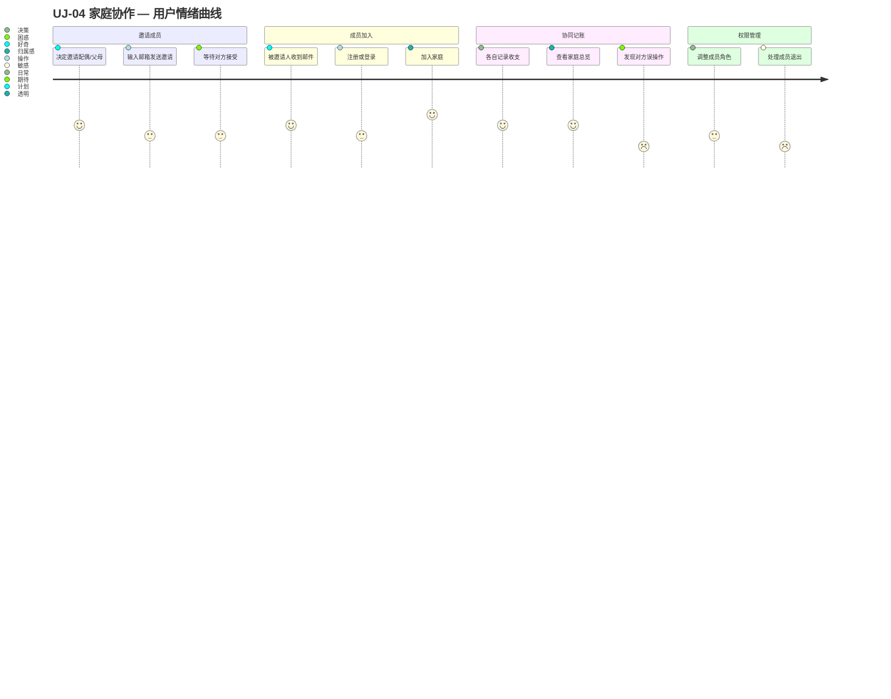

# UJ-04 家庭协作

> **目标**：支持多人协同管理家庭财务，确保数据共享和权限安全。

## 用户画像

- **主要**：[PERSONA-01](../../user-personas.md#persona-01-家庭管理员) 家庭管理员（邀请和管理成员）
- **次要**：[PERSONA-03](../../user-personas.md#persona-03-普通成员) 普通成员（被邀请加入，参与记账）

## 旅程阶段

### 阶段 1：邀请成员

家庭管理员决定邀请其他家庭成员共同使用 FFP。

- **触发**：配偶询问家庭财务状况 / 需要父母帮忙记录 / 子女成年独立管理
- **触点**：家庭成员管理页面
- **关键决策**：邀请谁？给什么权限？
- **产品目标**：邀请流程简单，权限说明清晰

### 阶段 2：成员加入

被邀请人接受邀请，加入家庭。

- **场景**：
  - 已有 FFP 账户：直接接受邀请加入家庭
  - 新用户：先注册，再自动加入家庭
- **触点**：邀请邮件 / 应用内通知
- **产品目标**：新用户的上手体验与 UJ-01 一致，但跳过"创建家庭"步骤

### 阶段 3：协同记账

多个成员各自记录，数据汇聚到家庭层面。

- **协作模式**：
  - 各自记录个人收支（默认归属自己）
  - 共同查看家庭总览
  - 管理员可调整归属或修正记录
- **冲突场景**：
  - 同一笔支出被两人重复记录
  - 成员误删他人记录（权限控制防止）
- **产品目标**：实时同步、冲突提示、操作追溯

### 阶段 4：权限管理

随着家庭成员变化，需要调整权限或处理退出。

- **场景**：
  - 子女成年，从 VIEWER 提升为 MEMBER
  - 离婚/分居，一方退出家庭
  - 家庭管理员转让
- **产品目标**：权限变更安全可控，退出时数据归属明确

## 涉及功能区域

| Theme | Epic | 说明 |
|-------|------|------|
| TH-02 认证与家庭权限 | epic-010 家庭成员管理 | 邀请、角色、退出 |
| TH-02 认证与家庭权限 | epic-002 认证授权 | 注册、登录、权限校验 |
| TH-01 财务记录管理 | epic-001, epic-004 | 多成员记账、记录归属 |

## 痛点与机会

| 阶段 | 痛点 | 机会 |
|------|------|------|
| 邀请成员 | 对方没有 FFP 账户，流程断裂 | 支持未注册用户通过邀请链接直接注册并加入 |
| 协同记账 | 重复记录 | 智能去重提示（金额+日期相近） |
| 协同记账 | 不知道谁在什么时候改了什么 | 操作日志 / 变更通知 |
| 权限管理 | 唯一管理员无法退出 | 强制转让管理员角色 |
| 权限管理 | 成员退出后数据归属不清 | 明确退出时数据保留策略 |

## 涉及 Scenario

| Scenario | 说明 |
|----------|------|
| — | 暂无跨 Feature 场景。邀请流程涉及 ft-003-auth（注册）→ epic-010（成员管理），待实现后评估是否开 scn。 |

## 关键指标

| 指标 | 目标值 | 说明 |
|------|--------|------|
| 邀请接受率 | > 60% | 发送邀请 → 对方成功加入 |
| 家庭平均人数 | > 2.0 | 每个家庭平均成员数 |
| 多成员记账率 | > 30% | 有 ≥2 个活跃记账成员的家庭占比 |

## 相关旅程

- 衔接：[UJ-02 日常记账](UJ-02-daily-record.md) — 多成员场景下的日常记账
- 衔接：[UJ-03 月度复盘](UJ-03-monthly-review.md) — 家庭层面的财务复盘
