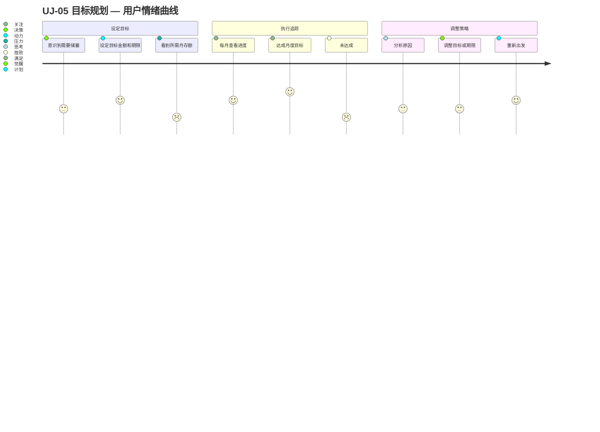

# UJ-05 目标规划

> **目标**：帮助用户设定和追踪财务目标，从记账工具升级为规划助手。

## 用户画像

- **主要**：[PERSONA-04](../../user-personas.md#persona-04-长期规划者) 长期规划者（有明确的储蓄或投资目标）
- **次要**：[PERSONA-01](../../user-personas.md#persona-01-家庭管理员) 家庭管理员（在复盘后发现需要规划）

## 旅程阶段

### 阶段 1：设定目标

用户意识到需要为某个未来事件储蓄，开始使用目标规划功能。

- **触发场景**：
  - 准备购房首付
  - 子女教育基金
  - 家庭应急储备金
  - 退休规划
- **触点**：目标规划页面
- **关键输入**：目标名称、目标金额、目标日期、当前已存金额
- **产品目标**：帮助用户设定现实可行的目标，提供计算器和参考值

### 阶段 2：执行追踪

用户在日常记账的同时，关注目标进度。

- **追踪方式**：
  - 仪表盘展示目标进度条
  - 每月自动计算"本月应存"
  - 超支时提醒对目标的影响
- **触点**：仪表盘、月度报告
- **产品目标**：目标进度可视化，正向激励

### 阶段 3：调整策略

当目标进度偏离预期时，用户调整策略。

- **调整类型**：
  - 延长目标期限（降低月存压力）
  - 增加月收入（副业、投资）
  - 削减非必要支出
  - 降低目标金额
- **产品目标**：提供"如果...会怎样"的模拟功能

## 涉及功能区域

| Theme | Epic | 说明 |
|-------|------|------|
| TH-05 财务规划 | epic-008 财务规划 | 目标设定、进度追踪 |
| TH-04 数据分析与可视化 | epic-007 仪表盘 | 目标进度展示 |
| TH-01 财务记录管理 | epic-001, epic-004 | 收支数据作为追踪基础 |

## 痛点与机会

| 阶段 | 痛点 | 机会 |
|------|------|------|
| 设定目标 | 不知道目标是否合理 | 基于历史收支数据推荐可行目标 |
| 设定目标 | 目标太多，无法聚焦 | 限制同时追踪目标数量 |
| 执行追踪 | 进度更新不直观 | 实时进度条 + 预计达成日期 |
| 执行追踪 | 超支后没有反馈 | 超支时自动计算对目标的影响 |
| 调整策略 | 不知道哪种调整最有效 | 模拟器：调整参数看结果 |

## 关键指标

| 指标 | 目标值 | 说明 |
|------|--------|------|
| 目标创建率 | > 20% | 活跃用户中创建目标的比例 |
| 目标达成率 | > 40% | 到期目标中达成的比例 |
| 目标活跃追踪率 | > 50% | 创建目标后持续查看进度的比例 |

## 相关旅程

- 前置：[UJ-03 月度复盘](UJ-03-monthly-review.md) — 复盘发现储蓄不足，驱动目标设定
- 衔接：UJ-06 智能建议（未来） — AI 基于目标给出个性化建议

## 涉及 Scenario

| Scenario | 说明 |
|----------|------|
| — | 目标规划功能尚未启动，无对应 scenario。 |

## 版本规划说明

本旅程涉及的功能（目标设定、进度追踪）属于 TH-05 财务规划 Theme，在当前 Roadmap 中优先级较低（P2）。建议在核心记账功能稳定后（ft-001 ~ ft-009 完成）再启动开发。
