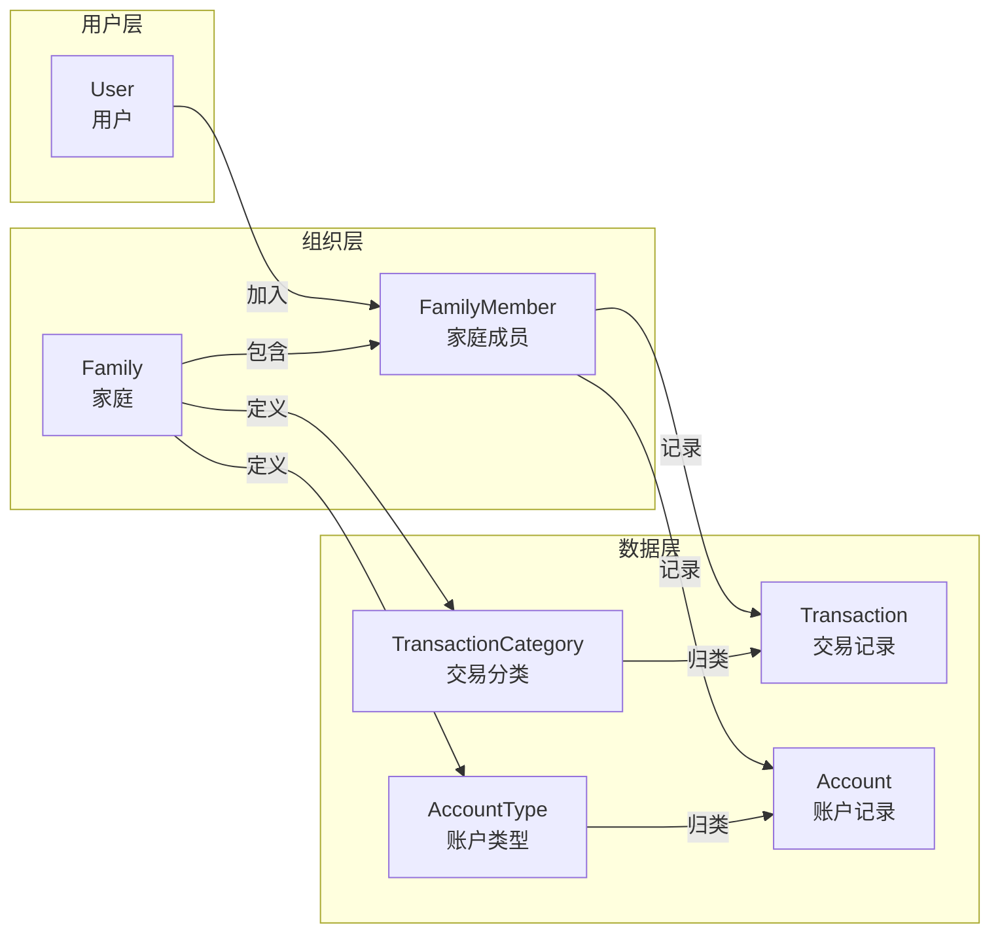
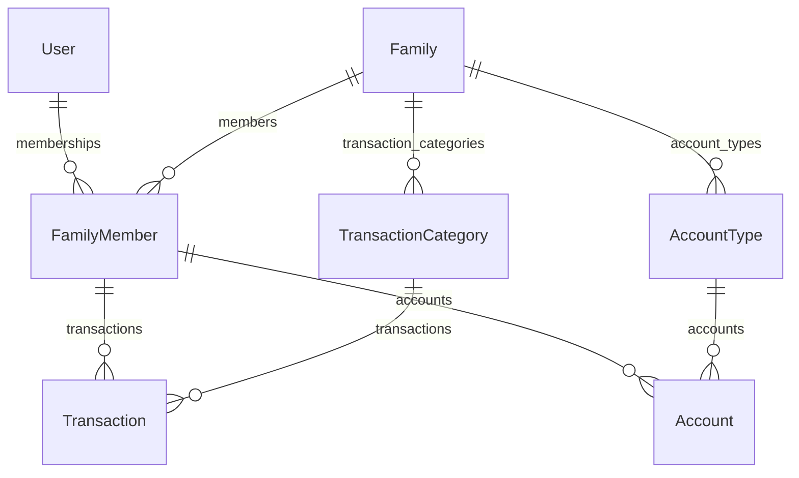
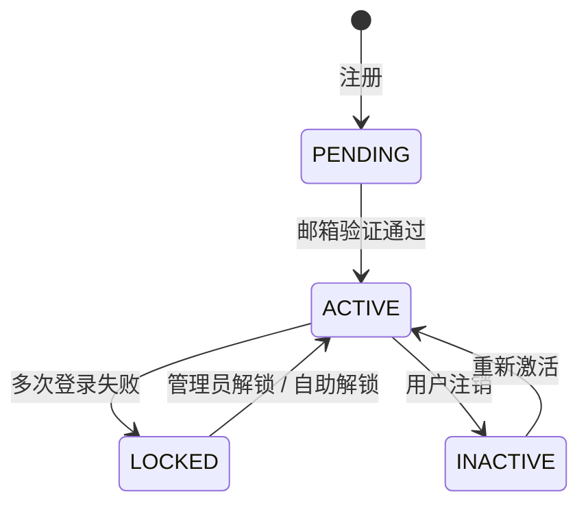
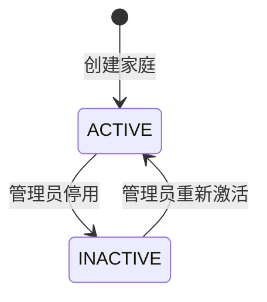

# 全局数据模型

本文档维护系统的全局领域模型概念层概述。

> 本文档遵循 [C4 Model](https://c4model.com/) 架构文档规范，作为 L4（代码/数据层）的补充文档。
>
> - L1 Context：系统与外部角色、外部系统的关系
> - L2 Container：系统内部的可独立部署/运行单元
> - L3 Component：容器内的代码模块及其协作关系
> - L4 Code：不维护（代码即事实源）
>
> **文档定位与阅读指引**：
>
> 本文档覆盖 **L3（领域语义层）** 与 **L4（数据层）概念概述**，具体边界如下：
>
> | 层级 | 内容 | 事实源 |
> |------|------|--------|
> | **L3 概念层** | 实体定义、业务关系、领域规则、状态机 | 本文档 |
> | **L4 字段级细节** | 类型约束、长度、精度、索引、映射 | 待实现时的数据库 schema 文件 |
> | **API 契约** | 请求/响应格式、校验规则 | [`OpenAPI 规范`](./api/openapi.yaml) |
>
> 第 5 节「实体定义」中的属性表仅列出**业务关键属性**的概念说明，字段级技术约束以实际数据库 schema 为准，本文档不重复维护，避免漂移。

---

## 1 领域上下文

FFP 的领域概念围绕"家庭"这一核心组织单元展开：



**关键设计约束**：

- 一个用户同时只能加入一个家庭（`current_family_id`）
- 家庭是租户隔离的核心单元，所有业务数据通过 `family_id` 隔离
- 交易记录（Transaction）和账户记录（Account）分属两个独立领域：前者处理流水，后者处理余额快照

---

## 2 实体清单

| 实体 | 说明 | 状态 | 相关 Feature |
|------|------|------|-------------|
| User | 用户账户 | 待设计 | — |
| Family | 家庭（租户隔离单元） | 待设计 | — |
| FamilyMember | 用户与家庭的多对多关系 | 待设计 | — |
| TransactionCategory | 收入/支出二级分类 | 待设计 | — |
| AccountType | 资产/负债类型分类 | 待设计 | — |
| Transaction | 收入/支出交易记录 | 待设计 | — |
| Account | 资产/负债账户记录 | 待设计 | — |

---

## 3 领域划分

FFP 将财务数据划分为两个独立的领域模型：

| 领域 | 模型 | 处理内容 | 分类体系 |
|------|------|----------|----------|
| **交易记录** | `Transaction` | 收入、支出流水 | `TransactionCategory`（INCOME / EXPENSE） |
| **账户记录** | `Account` | 资产、负债余额 | `AccountType`（ASSET / LIABILITY） |

> 旧设计决策参考：曾考虑过用统一的 `Transaction` 模型通过 `transactionType` 字段区分四种类型（INCOME/EXPENSE/ASSET/LIABILITY），后因资产/负债的数据特征（余额快照 vs 流水记录）与收入/支出差异过大，拆分为 `Transaction` + `Account` 两个模型。此决策仅作参考，实现阶段应重新评估。

---

## 4 ER 关系概览



**关系说明**：

| 关系 | Cardinality | 说明 |
|------|-------------|------|
| User → FamilyMember | 1:N | 一个用户可加入多个家庭（通过 FamilyMember 关联） |
| Family → FamilyMember | 1:N | 一个家庭可有多个成员 |
| Family → TransactionCategory | 1:N | 每个家庭独立定义交易分类 |
| Family → AccountType | 1:N | 每个家庭独立定义账户类型 |
| FamilyMember → Transaction | 1:N | 一个成员可记录多笔交易 |
| FamilyMember → Account | 1:N | 一个成员可记录多个账户余额 |
| TransactionCategory → Transaction | 1:N | 一个分类下有多笔交易 |
| AccountType → Account | 1:N | 一个类型下有多条账户记录 |

---

## 5 实体定义

> 以下各实体定义包含**概念层核心属性**与**业务规则说明**。属性表中的「类型」仅示意业务数据类型（如 UUID、String、Decimal），具体字段长度、精度、索引、默认值等技术约束以实际数据库 schema 为唯一事实源，本文档不重复维护。
>

### 5.1 User（用户）

用户账户，系统的核心身份实体。

**核心属性**：

| 属性 | 类型 | 必填 | 业务含义 |
|------|------|------|----------|
| id | UUID | 是 | 用户唯一标识 |
| email | String | 是 | 登录邮箱，全局唯一 |
| username | String | 是 | 用户昵称 |
| password_hash | String | 是 | bcrypt 加密后的密码 |
| phone | String | 否 | 手机号 |
| avatar | String | 否 | 头像 URL |
| status | UserStatus | 是 | 账户状态：active / inactive / locked |
| role | String | 是 | 角色：user / admin / super_admin |
| current_family_id | UUID | 否 | 当前活跃家庭 ID |
| default_family_id | UUID | 否 | 默认家庭 ID（首个创建的家庭） |

**状态机**：



**设计要点**：

- 支持一个用户同时只加入一个家庭（`current_family_id`）
- 用户创建的首个家庭作为默认家庭（`default_family_id`），退出其他家庭后自动回到默认家庭

---

### 5.2 Family（家庭）

家庭是核心组织单元，作为数据容器实现租户隔离。

**核心属性**：

| 属性 | 类型 | 必填 | 业务含义 |
|------|------|------|----------|
| id | UUID | 是 | 家庭唯一标识 |
| name | String | 是 | 家庭名称 |
| description | Text | 否 | 家庭描述 |
| avatar | String | 否 | 家庭头像 URL |
| currency | String | 是 | 货币代码，默认 CNY |
| timezone | String | 是 | 时区，默认 Asia/Shanghai |
| language | String | 是 | 语言，默认 zh-CN |
| status | FamilyStatus | 是 | 家庭状态：active / inactive |

**状态机**：



**设计要点**：

- 家庭是核心组织单元，作为数据容器实现租户隔离
- 所有业务数据通过 `family_id` 进行隔离

---

### 5.3 FamilyMember（家庭成员）

用户与家庭的多对多关系实体。

**核心属性**：

| 属性 | 类型 | 必填 | 业务含义 |
|------|------|------|----------|
| id | UUID | 是 | 关系唯一标识 |
| user_id | UUID | 是 | 关联用户 |
| family_id | UUID | 是 | 关联家庭 |
| role | MemberRole | 是 | 角色：ADMIN / MEMBER / VIEWER |
| status | String | 是 | 成员状态，默认 active |
| joined_at | Timestamp | 是 | 加入时间 |

**设计要点**：

- 实现 `User` ↔ `FamilyMember` ↔ `Family` 的多对多关系
- 多租户隔离的核心表，所有业务数据通过 `family_id` 隔离
- 支持用户在不同家庭间切换（当前业务约束为同时只能加入一个家庭）

---

### 5.4 TransactionCategory（交易分类）

收入/支出的二级分类体系。

**核心属性**：

| 属性 | 类型 | 必填 | 业务含义 |
|------|------|------|----------|
| id | UUID | 是 | 分类唯一标识 |
| family_id | UUID | 是 | 所属家庭 |
| name | String | 是 | 分类名称 |
| type | TransactionCategoryType | 是 | 类型：INCOME / EXPENSE |
| icon | String | 否 | 图标标识 |
| color | String | 否 | 颜色标识 |
| parent_id | UUID | 否 | 父分类 ID，实现二级分类 |
| sort_order | Int | 是 | 排序权重 |
| system_default | Boolean | 是 | 是否为系统预设分类 |

**设计要点**：

- 采用二级分类体系，通过 `parent_id` 自引用实现层级关系
- 支持系统预设分类（`system_default = true`）和用户自定义分类
- 家庭级别隔离，每个家庭可自定义分类体系
- **Transaction 关联规则**：`Transaction.category_id` 关联到 `TransactionCategory.id`。业务上建议关联到二级分类（叶子节点），但 schema 层不强制约束——一级分类也可被关联，由应用层校验控制。

---

### 5.5 AccountType（账户类型）

资产/负债的类型分类体系。

**核心属性**：

| 属性 | 类型 | 必填 | 业务含义 |
|------|------|------|----------|
| id | UUID | 是 | 类型唯一标识 |
| family_id | UUID | 是 | 所属家庭 |
| name | String | 是 | 类型名称 |
| type | AccountTypeCategory | 是 | 类型：ASSET / LIABILITY |
| icon | String | 否 | 图标标识 |
| color | String | 否 | 颜色标识 |
| sort_order | Int | 是 | 排序权重 |
| system_default | Boolean | 是 | 是否为系统预设类型 |

**设计要点**：

- 采用二级分类体系，支持灵活的资产负债分类
- 家庭级别隔离

---

### 5.6 Transaction（交易记录）

收入/支出流水记录。

**核心属性**：

| 属性 | 类型 | 必填 | 业务含义 |
|------|------|------|----------|
| id | BigInt | 是 | 自增主键 |
| family_id | UUID | 是 | 所属家庭（租户隔离） |
| member_id | UUID | 否 | 关联家庭成员（可选） |
| transaction_date | Date | 是 | 交易日期 |
| amount | Decimal(15,2) | 是 | 交易金额 |
| category_id | UUID | 是 | 交易分类 |
| transaction_type | Enum | 是 | INCOME 或 EXPENSE |
| description | String | 否 | 描述/备注 |
| created_by | UUID | 否 | 创建者用户 ID |
| updated_by | UUID | 否 | 最后更新者用户 ID |
| deleted_at | Timestamp | 否 | 软删除时间戳 |
| deleted_by | UUID | 否 | 删除者用户 ID |

**关联关系**：

```text
Transaction -->> FamilyMember (member_id, optional)
Transaction -->> TransactionCategory (category_id, required)
```

---

### 5.7 Account（账户记录）

资产/负债余额快照记录。

**核心属性**：

| 属性 | 类型 | 必填 | 业务含义 |
|------|------|------|----------|
| id | BigInt | 是 | 自增主键 |
| family_id | UUID | 是 | 所属家庭（租户隔离） |
| member_id | UUID | 是 | 关联家庭成员 |
| account_date | Date | 是 | 记账日期 |
| balance | Decimal(15,2) | 是 | 余额 |
| account_type_id | UUID | 是 | 账户类型 |
| account_category | Enum | 是 | ASSET 或 LIABILITY |
| description | String | 否 | 描述/备注 |
| created_by | UUID | 否 | 创建者用户 ID |
| updated_by | UUID | 否 | 最后更新者用户 ID |
| deleted_at | Timestamp | 否 | 软删除时间戳 |
| deleted_by | UUID | 否 | 删除者用户 ID |

**关联关系**：

```text
Account -->> FamilyMember (member_id, required)
Account -->> AccountType (account_type_id, required)
```

---

## 6 业务规则与校验

以下规则在应用层（Service）强制执行，schema 层仅保证基础约束：

| 规则 | 说明 | 校验位置 |
|------|------|----------|
| **金额大于 0** | Transaction.amount 和 Account.balance 必须大于 0 | Service 层 |
| **交易日期限制** | transaction_date / account_date 不能是未来日期 | Service 层 |
| **分类归属校验** | category_id / account_type_id 必须属于当前家庭 | Service 层 |
| **成员归属校验** | member_id 必须属于当前家庭 | Service 层 |
| **家庭隔离** | 所有查询必须过滤 family_id | Service 层 / Middleware |
| **软删除不可更新** | deleted_at 不为 NULL 的记录禁止修改 | Service 层 |
| **二级分类建议** | Transaction 建议关联到二级分类（叶子节点），由应用层提示但不强制 | Service 层 |

---

## 7 审计字段约定

`Transaction` 与 `Account` 均包含以下审计字段：

| 字段 | 说明 |
|------|------|
| `created_by` | 创建者用户 ID |
| `updated_by` | 最后更新者用户 ID |
| `deleted_by` | 执行软删除的用户 ID |
| `deleted_at` | 软删除时间戳（NULL 表示未删除） |

> **设计决策**：不引入 `version` 乐观锁字段。FFP 为单用户家庭内协作场景，并发冲突概率极低；若后续出现需求，再通过 migration 追加。

---

## 8 枚举类型

| 枚举 | 值 | 说明 |
|------|-----|------|
| **UserStatus** | active / inactive / locked | 用户账户状态 |
| **FamilyStatus** | active / inactive | 家庭状态 |
| **MemberRole** | ADMIN / MEMBER / VIEWER | 家庭成员角色 |
| **TransactionCategoryType** | INCOME / EXPENSE | 交易分类类型 |
| **AccountTypeCategory** | ASSET / LIABILITY | 账户类型分类 |

---

## 9 代码实现（待补充）

> 本节在数据库 schema 和模块结构确定后补充。
>
> 需记录内容：
> - 数据库 schema 文件位置与 ORM 选型
> - 实体与后端模块/前端页面的对应关系
> - 常用的 schema 管理命令

---

## 10 相关文档

- [c4-l1-context.md](../architecture/c4/context.md) — 系统上下文
- [c4-l2-container.md](../architecture/c4/container.md) — 容器视角
- [c4-l3-component.md](../architecture/c4/component.md) — 组件视角
- [API 规范](../api/openapi.yaml) — OpenAPI 定义
- [架构决策](../decisions/) — ADR 记录（目录链接）
