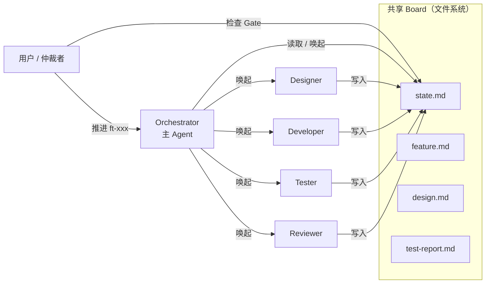

# 通用规范

本文档包含所有研发流程共享的设计原则、工件体系、智能体定义与协调机制。Feature、Tech Debt、Defect 三类流程均需遵守。

---

## 1. 设计原则与元规范

### 1.1 设计原则

| 原则 | 说明 |
|------|------|
| **关注点分离** | 每个智能体只做一件事；Designer 设计、Developer 实现、Tester 验证、Reviewer 审视 |
| **最小人类介入** | 用户只在真正需要人类判断的 Gate 介入 |
| **状态外化** | 智能体不持有流程状态，状态通过 `state.md` 共享 Board 传递 |
| **轻量优先** | Tech Debt 和 Defect 保持轻量 PR 路线 |

### 1.2 规范分层

| 层级 | 位置 | 核心问题 | 详情见 |
|------|------|---------|--------|
| **L1 工具强制** | CI 脚本、pre-commit hooks、Lint 配置、GitHub Settings | 机器能自动检查并阻断什么？ | 配置文件（不重复在此） |
| **L2 项目级流程** | `_common.md` | 所有 Agent 必须共同遵守的最小硬约束是什么？ | [`_common.md`](../../.claude/agents/prompts/_common.md) |
| **L3 Agent 级职责** | Agent Prompt | 每个角色的方法论和行为边界是什么？ | 本文件 §3 各角色定义；完整定义见 Agent Prompt |
| **L4 任务级技术** | Skill | 特定任务的标准操作流程和模板是什么？ | 本文件 §5 Skill 列表 |

### 1.3 三类规范载体的定位

**`_common.md`** 是项目宪章——所有 Agent 共享的最小必要约束集。

**Agent Prompt** 只保留该角色特有的、无法工具化的、需要上下文理解的规范（如 Red-Green-Refactor 方法论、架构一致性检查的关键词选择策略）。

**Skill** 同时满足以下 6 条才值得独立：

1. **高频触发**：每次 feature 都会用到，不是一次性的
2. **有固定规范**：有模板、checkList 或标准流程，不靠临场发挥
3. **跨会话复用**：不同 feature 之间规则一致
4. **Agent Prompt 中篇幅较大**：从 150–200 行的 Prompt 中提取，减少上下文负担
5. **粒度对应一个完整任务场景**：一个 Skill 对应"写一份 ADR"、"开一次 PR"、"设计一组 E2E 用例"这类完整任务，而非一个角色的全部工作
6. **可被独立触发调用**：Skill 必须能通过 `/skill-name` 被外部独立唤起，而非仅作为 Prompt 内嵌片段

---

## 2. 文档与工件体系

### 2.1 工件导航（按生命周期）

#### 全局长期维护（evergreen）

| 工件 | 位置 | 修改审批 | 说明 |
|------|------|---------|------|
| C4 L1-L3 架构图 | `docs/architecture/c4/*.md` | 架构审批 Gate | 系统 / 容器 / 组件 |
| OpenAPI | `docs/api/openapi.yaml` | 架构审批 Gate | API 契约 |
| 数据模型 | `docs/data/data-model.md` | 架构审批 Gate | 领域模型 |
| ADR | `docs/decisions/` | 新 ADR 需审批 | 架构决策记录 |
| 质量管道（测试 + CI/CD） | `docs/architecture/quality-pipeline.md` | 架构审批 Gate | 测试策略与流水线设计 |
| 前后端开发指南 | `docs/architecture/*-guide.md` | PR | 操作入口 |
| 测试资产注册表 | `docs/quality/test-registry.md` | PR | 全局测试用例汇总（用例 ID / 层级 / Feature / Smoke / 状态） |
| 业务流程 | `docs/architecture/dynamic/` | PR | 端到端用户旅程（Designer T1/T2/T3 触点） |
| Product Backlog | `docs/backlog/Product-Backlog.md` | PR + 用户确认 | Feature 索引 + 路线图 |

**全局工件版本控制**：

OpenAPI、data-model.md 等架构级文档变更时，须在文件头部维护 `version`（遵循 semver）和 `last_updated` 字段，并在 PR 描述中说明变更兼容级别：

- **patch**：字段描述修正、示例更新，向后兼容
- **minor**：新增端点/字段/表，向后兼容
- **major**：删除或修改已有契约，不兼容——必须同步更新所有消费方并走架构审批 Gate

#### Feature 快照（frozen / active）

| 工件 | 位置 | 生命周期 | 说明 |
|------|------|---------|------|
| feature.md | `docs/backlog/{epic}/{ft}/` | frozen | 需求与设计 |
| us-*.md | `docs/backlog/{epic}/{ft}/` | frozen | 用户故事（Designer 在需求澄清阶段拆分产出） |
| design.md | `docs/backlog/{epic}/{ft}/` | frozen | 详细设计 |
| architecture-review.md | `docs/backlog/{epic}/{ft}/` | frozen | 架构评审结论 |
| test-plan.md | `docs/backlog/{epic}/{ft}/test-cases/` | frozen | 测试计划 |
| test-report.md | `docs/backlog/{epic}/{ft}/test-cases/` | frozen | P0 门禁依据 |
| state.md | `docs/backlog/{epic}/{ft}/` | active | 共享状态板 |
| process-review.md | `docs/backlog/{epic}/{ft}/` | Done 后产出，产出后 frozen | 流程复盘（按需） |

#### US（用户故事）与 UC（用例）职责边界

| 维度 | US (User Story) | UC (Use Case) |
|------|----------------|---------------|
| **读者** | PO、用户、Designer | Developer、Tester、Reviewer |
| **核心问题** | What + Why（做什么、为什么） | How（系统怎么做） |
| **格式** | Given/When/Then | sequenceDiagram + 业务规则表 |
| **错误路径** | 关键业务异常（用户可见） | 全部异常（含技术异常、权限异常） |
| **维护频率** | 低（业务价值稳定） | 中（技术实现可能调整） |

**协作规则**：
1. feature.md 的"验收标准"节不重复写 AC，改为引用 `us-*.md`
2. `us-*.md` 的 AC 使用 Given/When/Then 格式，直接支撑 test-plan.md 的 P0 设计
3. `uc-*.md` 聚焦系统交互序列图、业务规则和维护触发器

### 2.2 目录结构（完整树）

```text
docs/
├── backlog/
│   ├── Product-Backlog.md
│   └── {epic-id}/
│       └── {feature-id}/
│           ├── feature.md
│           ├── us-*.md
│           ├── design.md
│           ├── architecture-review.md
│           ├── test-cases/
│           │   ├── test-plan.md
│           │   └── test-report.md
│           ├── state.md
│           └── process-review.md
├── architecture/
│   ├── c4/                    # C4 模型（L1/L2/L3）
│   │   ├── context.md
│   │   ├── container.md
│   │   └── component.md
│   ├── dynamic/               # 业务流程（Dynamic View）
│   │   └── seq-*.md
│   └── quality-pipeline.md       # 测试策略与 CI/CD 设计
├── quality/
│   └── test-registry.md           # 测试资产注册表
├── data/
│   └── data-model.md
├── api/
│   ├── openapi.yaml
│   └── README.md
└── decisions/
    └── adr-*.md
└── process/
    ├── README.md               # 入口：流程速查与通用规范索引
    ├── common.md               # 本文档
    ├── feature-flow.md         # Feature 开发流程
    ├── tech-debt-flow.md       # Tech Debt 清理流程
    ├── defect-flow.md          # Defect 修复流程
    ├── storybook-guide.md      # Storybook 规范
    ├── templates/
    └── reviews/
```

---

<a id="agents"></a>

## 3. 核心智能体定义

| 角色 | 触发时机 | 结束条件 | 核心职责 | 完整定义 |
|------|---------|---------|---------|---------|
| **Designer** <span id="designer"></span> | 新 Feature / `state.current === Draft` | 用户设计方案审批通过 | 需求澄清、交互与架构设计 | [`.claude/agents/prompts/designer.md`](../../.claude/agents/prompts/designer.md) |
| **Developer** <span id="developer"></span> | `state.current === Designed` | PR CI 全绿 → `Testing` | 代码实现、单元测试 | [`.claude/agents/prompts/developer.md`](../../.claude/agents/prompts/developer.md) |
| **Tester** <span id="tester"></span> | `Designed`（设计用例）/ `Testing`（执行） | P0 全绿 + `Done` | 测试设计、P0 门禁、feature 收尾 | [`.claude/agents/prompts/tester.md`](../../.claude/agents/prompts/tester.md) |
| **Reviewer** <span id="reviewer"></span> | 架构预审 / PR 打开 / 契约矛盾 | Approved / Changes Requested | 架构评审、代码评审、契约裁决 | [`.claude/agents/prompts/reviewer.md`](../../.claude/agents/prompts/reviewer.md) |

**Reviewer 独立性**：评审必须基于工件文件（`design.md` / PR diff），不依赖对话历史。Reviewer 与 Tester 意见冲突时升级到用户 Gate 裁决，结果写入 `state.md` 的 `pending_reviews`。

---

## 4. Sub-agent 协调机制

### 4.1 共享 Board 设计



**设计要点**：

- `state.md` 是唯一的共享状态源，所有 agent 可读可写
- 用户是**仲裁者**（决定 Gate 通过与否），不是**中转站**（不传递消息）
- Agent 之间不直接通信，通过 `state.md` 和共享目录传递信息

### 4.2 state.md 共享 Board 规范

```yaml
---
type: state
feature_id: ft-XXX-slug
current: Draft
history:
  - timestamp: "2026-05-18T10:00:00Z"
    from: "*"
    to: Draft
    reason: "feature 创建"
blockers: []          # 当前阻塞点
pending_reviews: []   # 待评审项
code_paths: []        # 关联代码路径
ci_status:            # CI 门禁状态
  pr_checks: N/A      # PR CI 状态：N/A / PASS / FAIL
  main_checks: N/A    # main CI 状态：N/A / PASS / FAIL
test_status:          # 测试执行状态
  p0: N/A             # P0 门禁：N/A / PASS / FAIL
  p1: N/A             # P1 用例：N/A / PASS / FAIL
  p2: N/A             # P2 用例：N/A / PASS / FAIL
---

# 当前阻塞
<!-- agent 在此说明当前阻塞原因 -->

# 待处理事项
<!-- agent 在此列出待处理项 -->

# 备注
<!-- 其他需要传递的信息 -->
```

### 4.3 Agent 更新规则

| 字段 | 写入者 | 规则 |
|------|--------|------|
| `current` | **仅主 Agent（Orchestrator）** | sub-agent 完成后通过 `.last-action-summary.md` 汇报，由主 Agent 统一更新 |
| `blockers` | **仅主 Agent（Orchestrator）** | sub-agent 在备注区说明阻塞原因，主 Agent 评估后写入 |
| `history` | 任何完成工作的 Agent | **追加**写入，天然无冲突 |
| `pending_reviews` | 提交评审的 Agent | Reviewer/Tester 写入，主 Agent 在状态迁移时清理 |
| `ci_status` | Developer / Tester | 对应角色在完成 CI 相关任务后更新 |
| `test_status` | Tester | 测试执行完成后更新 |

**并发写入原则**：`current`/`blockers` 由主 Agent 串行管理，其余字段由各 Agent 按职责写入。若发生写冲突，以**主 Agent 的写入为准**。

---

## 5. 技能体系（Skill）

### 5.1 判定标准

判定标准见 [§1.3 规范分层](#13-三类规范载体的定位) 中 Skill 的 6 条判定规则，此处不再重复。

### 5.2 Skill 维护规范

- **变更审批**：Skill 的修改走 PR 流程，由 Reviewer 审批——Agent 行为直接依赖 Skill，变更影响面大
- **依赖声明**：Skill 之间若存在依赖（如 `test-execution` 依赖 `test-design-rubric` 的用例 ID 规范），须在 Skill 文档顶部显式声明依赖列表
- **版本标记**：Skill 文档头部保留 `version` 字段，重大规则变更时递增，便于 Agent 判断是否需要重新加载

### 5.3 现有 Skill 与分层映射

Skill 属于 **L4 任务级技术**，是 Agent Prompt（L3）中可提取的规范化任务片段。

| Skill | 适用场景 |
|-------|---------|
| `feature-pr-flow` | PR 规范、分支命名、合并规则 |
| `feature-design` | feature.md / design.md 编写 |
| `design-review` | design.md 架构评审 |
| `code-review` | PR 代码评审 |
| `engineering` | 技术栈编码规范与自检流程 |
| `test-design-rubric` | 测试用例设计 |
| `test-execution` | 测试执行流程 |
| `e2e-playwright` | E2E 测试 selector/等待策略 |
| `storybook-authoring` | Storybook stories 编写 |
| `adr-writing` | ADR 写作规范 |

---

## 6. 参考资源

**按读者分类**：

| 读者 | 文档 | 说明 |
|------|------|------|
| 人类（流程总览） | [智能体 Prompt](../../.claude/agents/prompts/) | 完整智能体定义，按角色浏览 |
| Agent（流程总览） | [`_common.md`](../../.claude/agents/prompts/_common.md) | 项目宪章，所有 Agent 必读 |
| Designer / Reviewer | [`feature-design`](../../.claude/skills/feature-design/SKILL.md)、[`design-review`](../../.claude/skills/design-review/SKILL.md) Skill | feature.md / design.md 的编写与评审规范 |
| Developer | [`engineering`](../../.claude/skills/engineering/SKILL.md) Skill | 技术栈编码规范、自检流程、单元测试模板 |
| Developer / Reviewer | [`code-review`](../../.claude/skills/code-review/SKILL.md) Skill | PR 评审 checklist 与红线 |
| Tester | [`test-design-rubric`](../../.claude/skills/test-design-rubric/SKILL.md)、[`e2e-playwright`](../../.claude/skills/e2e-playwright/SKILL.md) Skill | 用例设计、E2E 规范 |
| 架构决策 | [ADR 目录](../decisions/)、[`adr-writing`](../../.claude/skills/adr-writing/SKILL.md) Skill | 历史决策记录与写作模板 |
| Feature / Bug 模板 | [`docs/process/templates/`](./templates/) | 创建 Issue 或 feature 文档时使用 |
| 质量管道（测试 + CI/CD） | [`docs/architecture/quality-pipeline.md`](../architecture/quality-pipeline.md) | 测试策略与流水线设计 |

### 变更记录

**汇聚规则**：`.claude/skills/*` 和 `.claude/agents/prompts/*.md` 中的规则变更（`version` 递增或 `human_doc` / `depends_on` 调整），须在此登记一句话摘要。人类通过此表即可感知所有流程规则的近期变化，无需逐个打开 Skill。

| 日期 | 版本 | 变更内容 |
|------|------|----------|
