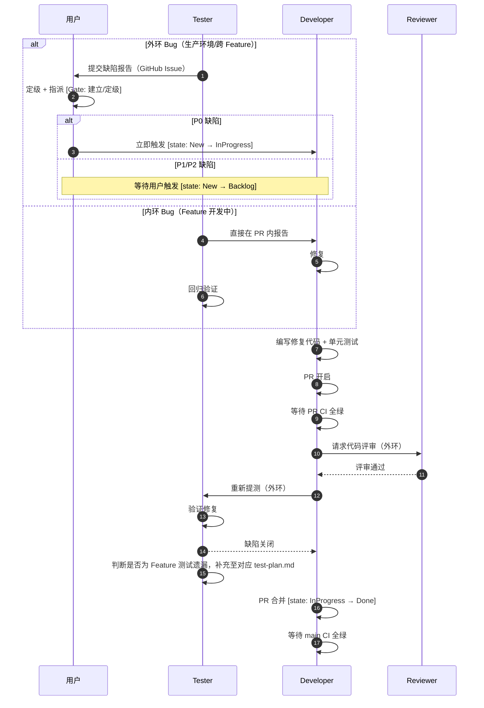
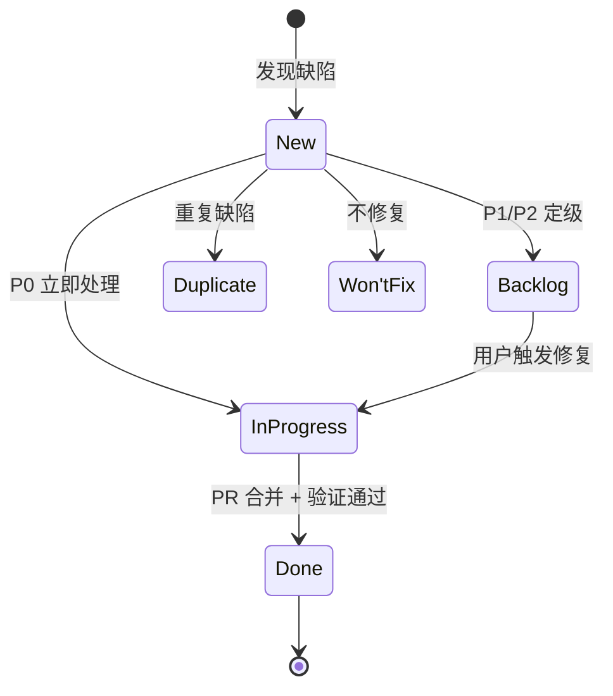

# Defect 修复流程

## 1.1 协作时序

## 1.2 状态机

## 1.3 Gate

| Gate | 触发时机 | 状态影响 | 说明 |
|------|---------|---------|------|
| **建立/定级** | 发现缺陷 | `New → Backlog` 或 `New → InProgress` | P0 立即处理，P1/P2 进 Backlog |
| **关闭** | PR 合并 + 验证通过 | `InProgress → Done` | — |

**缺陷根因分析（外环缺陷）**：

外环缺陷关闭前，执行者必须填写轻量级根因分析，写入 GitHub Issue comment：

- **测试遗漏**：测试用例未覆盖该场景 → 补充对应 `test-plan.md` 用例
- **设计遗漏**：`design.md` 未考虑该边界 → 更新设计文档并反思拆分粒度
- **实现偏差**：Developer 理解设计与实现不符 → 检查编码输入是否充分
- **环境差异**：本地/CI 与生产环境行为不一致 → 检查 CI 仿真度
- **回归失效**：修改引入新缺陷，现有测试未拦截 → 检查测试层级覆盖
