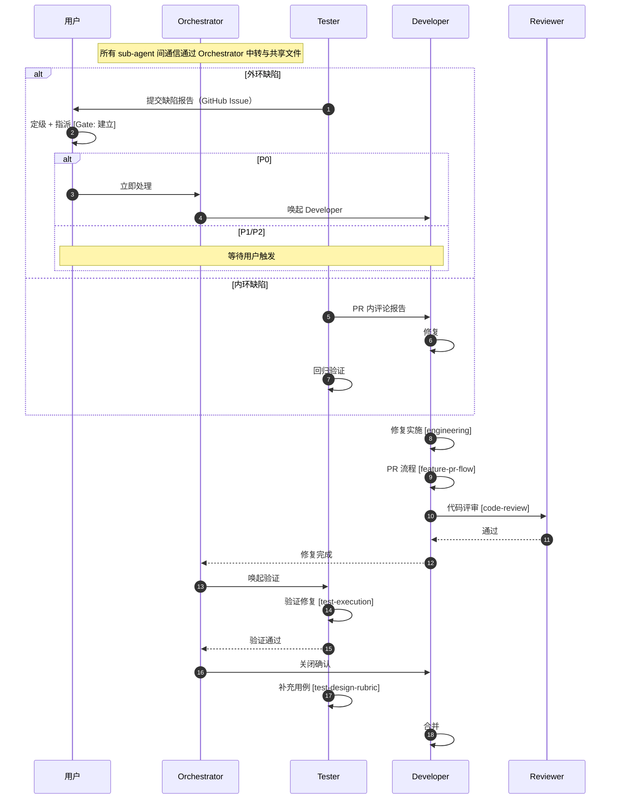
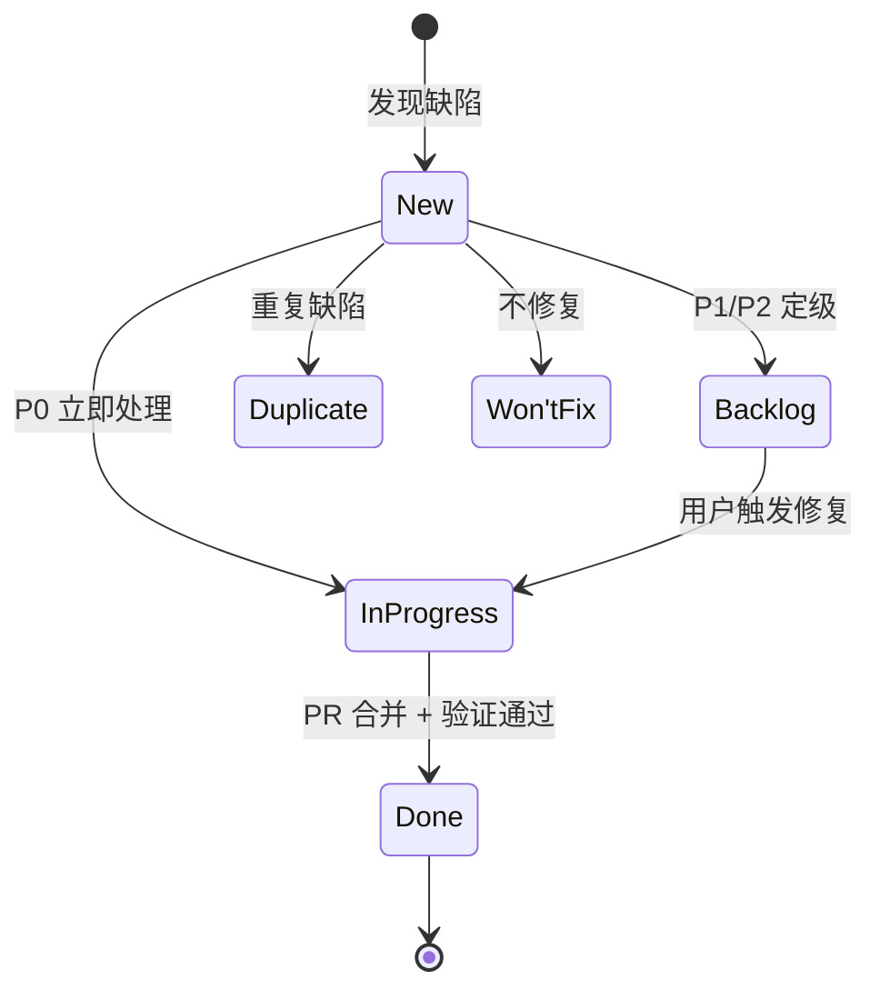

# Defect 修复流程

## 协作时序

```mermaid
sequenceDiagram
  autonumber
  participant U as 用户
  participant O as Orchestrator
  participant T as Tester
  participant D as Developer
  participant R as Reviewer

  Note over O: 所有 sub-agent 间通信通过 Orchestrator 中转与共享文件

  alt 外环缺陷
    T->>U: 提交缺陷报告（GitHub Issue）
    U->>U: 定级 + 指派 [Gate: 建立]
    alt P0
      U->>O: 立即处理
      O->>D: 唤起 Developer
    else P1/P2
      Note over U,D: 等待用户触发
    end
  else 内环缺陷
    T->>D: PR 内评论报告
    D->>D: 修复
    T->>T: 回归验证
  end

  D->>D: 修复实施 [engineering]
  D->>D: PR 流程 [feature-pr-flow]
  D->>R: 代码评审 [code-review]
  R-->>D: 通过
  D-->>O: 修复完成
  O->>T: 唤起验证
  T->>T: 验证修复 [test-execution]
  T-->>O: 验证通过
  O->>D: 关闭确认
  T->>T: 补充用例 [test-design-rubric]
  D->>D: 合并
```

## 状态机

```mermaid
stateDiagram-v2
  [*] --> New : 发现缺陷
  New --> Backlog : P1/P2 定级
  New --> InProgress : P0 立即处理
  Backlog --> InProgress : 用户触发修复
  InProgress --> Done : PR 合并 + 验证通过
  Done --> [*]

  New --> Duplicate : 重复缺陷
  New --> Won'tFix : 不修复
```

## Gate 模型

| Gate | 触发时机 | 说明 |
|------|---------|------|
| 建立/定级 | 发现缺陷 | P0 立即处理，P1/P2 进 Backlog |
| 关闭 | PR 合并 + 验证通过 | — |

## 阶段-Skill 映射

| 阶段 | 执行 Agent | Skill | 关键产出 | Gate |
|------|-----------|-------|---------|------|
| 定级指派 | 用户 | — | severity + owner | 建立 |
| 修复实施 | Developer | `engineering` | 修复代码 + 单测 | — |
| 代码评审 | Reviewer | `code-review` | 评审意见 | — |
| 验证修复 | Tester | `test-execution` | 验证结果 | — |
| 根因分析 | Tester | — | GitHub Issue comment | 关闭 |
| 补充用例 | Tester | `test-design-rubric` | test-plan.md 更新 | — |

## 根因分析

外环缺陷关闭前，执行者必须填写轻量级根因分析，写入 GitHub Issue comment：

- **测试遗漏**：测试用例未覆盖该场景 → 补充对应 test-plan.md 用例
- **设计遗漏**：design.md 未考虑该边界 → 更新设计文档并反思拆分粒度
- **实现偏差**：Developer 理解设计与实现不符 → 检查编码输入是否充分
- **环境差异**：本地/CI 与生产环境行为不一致 → 检查 CI 仿真度
- **回归失效**：修改引入新缺陷，现有测试未拦截 → 检查测试层级覆盖
