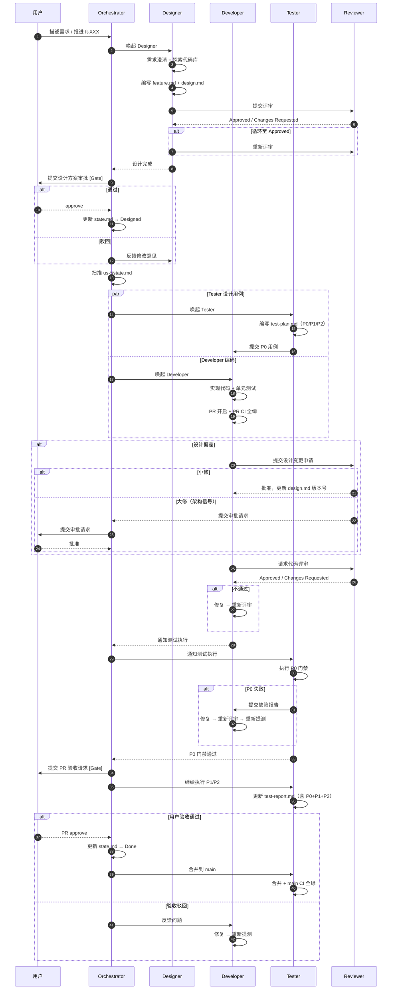
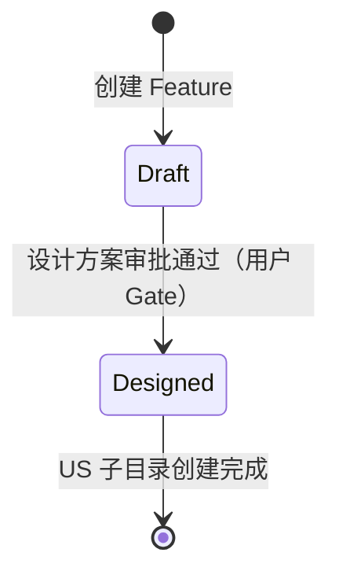
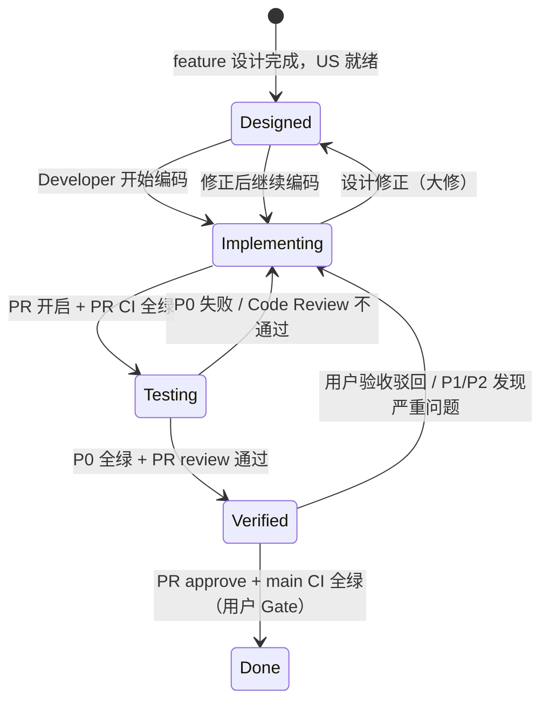

# Feature 开发全流程

## 协作模型

参与者：用户、Orchestrator、Designer、Developer、Tester、Reviewer。

**原则**：Gate 最小化（阻塞点），80% 工作由子 Agent 自主完成，Gate 处为二元决策。

## 协作时序

## 状态模型

采用两级状态模型：feature 级（设计阶段）+ US 级（交付阶段）。

### Feature 级状态机

### US 级状态机

**状态语义**：

| 状态 | 含义 | 进入条件 | 离开条件 |
|------|------|----------|---------|
| `Designed` | US 设计就绪，等待实现 | feature 设计完成，US 子目录创建 | Developer 开始编码 |
| `Implementing` | US 开发中 | Developer 开始写代码 | PR CI 全绿 |
| `Testing` | 代码完成，测试执行中 | PR CI 全绿 | P0 全过 + Reviewer 通过 |
| `Verified` | P0 全绿 + PR review 通过 | P0 全过 + Reviewer 通过 | PR approve + main CI 全绿 |
| `Done` | 用户验收通过 | main CI 全绿 | — |

**设计修正规则**（`Implementing → Designed → Implementing`）：

- **小修**（字段增减、接口参数调整）：Reviewer 直接批准，更新 `design.md` 版本号
- **大修**（系统边界、数据模型、外部依赖）：转设计方案审批 Gate
- **修正上限**：同一 feature 累计 ≥ 3 次大修，停止推进，escalate 给用户

**Feature 完成条件**：所有 US 均达到 `Done`。

## Gate 模型

| Gate | 触发时机 | 通过条件 |
|------|---------|---------|
| **设计方案审批** | Designer 提交 feature.md + design.md | 用户 approve |
| **验收通过** | P0 全绿 + PR review 通过 + PR CI 全绿 | PR approve |

**架构信号**（设计方案审批时一并审查）：OpenAPI 变更、data-model 变更、CI/CD 变更、新增外部依赖、跨越系统边界。

## 编排规则

用户说「推进 ft-XXX」时，Orchestrator 读取 feature/state.md，若为 `Designed` 则扫描所有 us-*/state.md，按优先级（`Designed → Implementing → Testing → Verified → Done`）选择可推进的 US 并唤起对应 Agent。完整执行表与异常处理规则见 [orchestrator.md](../../.claude/agents/prompts/orchestrator.md)。