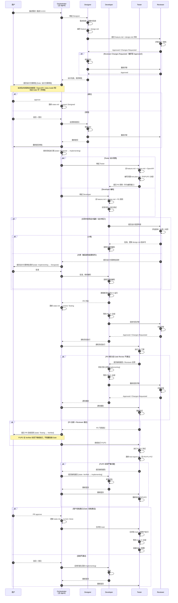
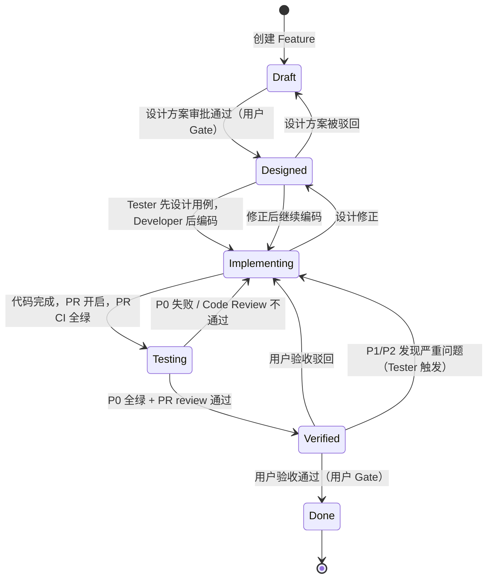

# Feature 开发全流程

## 1.1 协作时序

## 1.2 状态机

**状态语义**：

| 状态 | 含义 | 进入条件 | 离开条件 |
|------|------|----------|---------|
| `Draft` | 需求 / 设计草案 | 新 feature 创建 | 设计方案审批通过 → `Designed` |
| `Designed` | 设计冻结，可开工 | 用户设计方案审批通过 | Developer 开始编码 → `Implementing` |
| `Implementing` | 开发中 | Developer 开始写代码 | 代码 push + PR 开启 + **PR CI 全绿** → `Testing` |
| `Testing` | 代码完成，测试执行中 | PR CI 全绿 | P0 全过 + Reviewer 通过 → `Verified` |
| `Verified` | P0 全绿 + PR review 通过，P1/P2 执行中或已完成 | P0 全过 + Reviewer 通过 | 用户 PR approve + 合并 + **main CI 全绿** → `Done` |
| `Done` | 用户验收通过，feature 收尾 | main CI 全绿 | — |

**设计修正**（`Implementing → Designed → Implementing`）：

开发过程中发现设计遗漏或偏差时，Developer 提出设计变更申请，Reviewer 评估影响：

- **小修**（字段增减、接口参数调整、局部逻辑变更）：Reviewer 直接批准，Developer 更新 `design.md` 版本号后继续编码
- **大修**（跨越系统边界、数据模型变更、新增外部依赖）：转**设计方案审批 Gate**，通过后回到 `Implementing`
- **修正次数上限**：同一 feature 累计触发设计修正 ≥ 3 次时，Orchestrator 停止自动推进，escalate 给用户评估是否需要回退到 `Draft` 重新设计

## 1.3 用户 Gate

设计原则：**阻塞性 Gate，数量最小化**。80% 的工作由子智能体自主完成，Gate 处决策为二元选择（通过/驳回）。

| Gate | 触发时机 | 介入者 | 状态影响 | 通过条件 | 驳回处理 |
|------|---------|--------|---------|---------|---------|
| **建立** | Feature 创建 | 用户 | — | 用户显式指定 `ft-xxx` 或迭代计划选中；创建 feature 目录后进入 Draft | 驳回，不创建目录 |
| **设计方案审批** | Designer 提交 feature.md + design.md | 用户 | `Draft → Designed` | approve；如涉及以下架构信号，一并审批 | Designer 修改 → 重新提交 |
| **验收通过** | P0 全绿 + PR review 通过 + PR CI 全绿 | 用户 | `Verified → Done` | PR approve | Developer 修复 → 重新提测 |

**设计方案审批中的架构信号**（涉及时需一并审查）：

- OpenAPI 新增/删除/修改端点
- data-model.md 新增/修改表或字段
- CI/CD 流程变更
- 新增外部依赖
- 跨越已有系统边界

## 1.4 涉及角色

| 阶段 | Designer | Developer | Tester | Reviewer |
|------|----------|-----------|--------|----------|
| 需求澄清 | 主导 | — | — | — |
| 交互/架构设计 | 主导 | — | — | 设计评审 |
| 设计方案审批 | 提交 | — | — | — |
| 编码实现 | — | 主导 | — | — |
| 设计修正 | 修改设计 | 提出申请 | — | 影响评估 |
| 单元测试 | — | 主导 | — | — |
| 测试用例设计 | — | — | 主导 | — |
| 代码评审 | — | 响应 | — | 主导 |
| 测试执行 | — | 修复缺陷 | 主导 | — |
| P0 门禁 | — | — | 执行 | — |
| 用户验收 | — | — | 提交报告 | — |
| Feature 收尾 | — | 主导（代码清理、分支删除） | 主导（`process-review.md` 产出） | — |

## 1.5 主 Agent 编排

本项目采用**主 Agent 编排** 模式：用户说"推进 ft-XXX"，Claude 读取 `state.md` 后自动判断当前状态、唤起正确的 sub-agent，人类只在需要判断的 Gate 处介入。Orchestrator 的完整行为定义与交互模板见 [`.claude/agents/prompts/orchestrator.md`](../../.claude/agents/prompts/orchestrator.md)。

### 状态机执行表

主 Agent 按以下规则决定下一步动作，完整执行表（含条件分支、Escalate 规则）见 [`orchestrator.md`](../../.claude/agents/prompts/orchestrator.md) §Step 3。

完整的循环路径、关键设计约束及标准化文件定义见 [`.claude/agents/prompts/orchestrator.md`](../../.claude/agents/prompts/orchestrator.md)。

## 1.6 PR 规范

所有 commit 必须走 PR，不准直接推 main。分支命名、Conventional Commits、PR 模板、CI 门禁、合并规则等细节见 [`feature-pr-flow`](../../.claude/skills/feature-pr-flow/SKILL.md) Skill——人类文档此处不重复操作细节。
