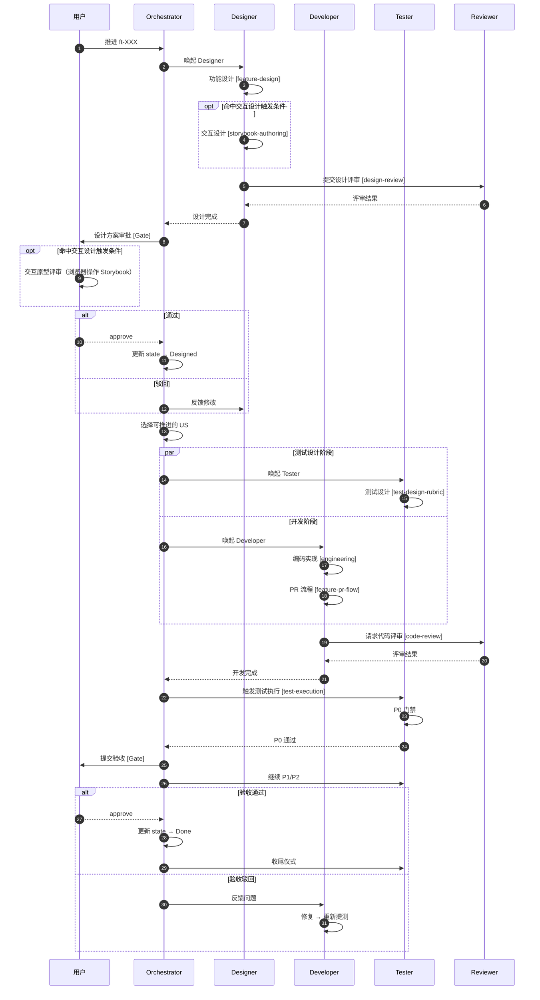
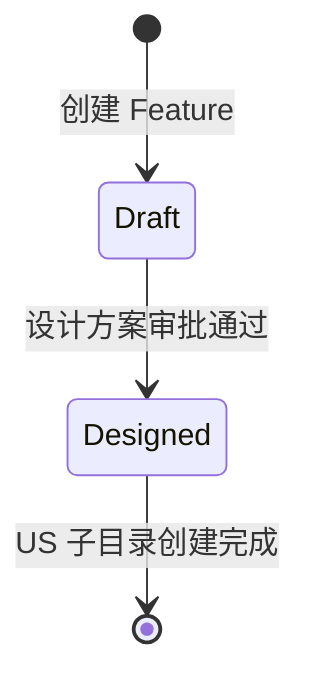
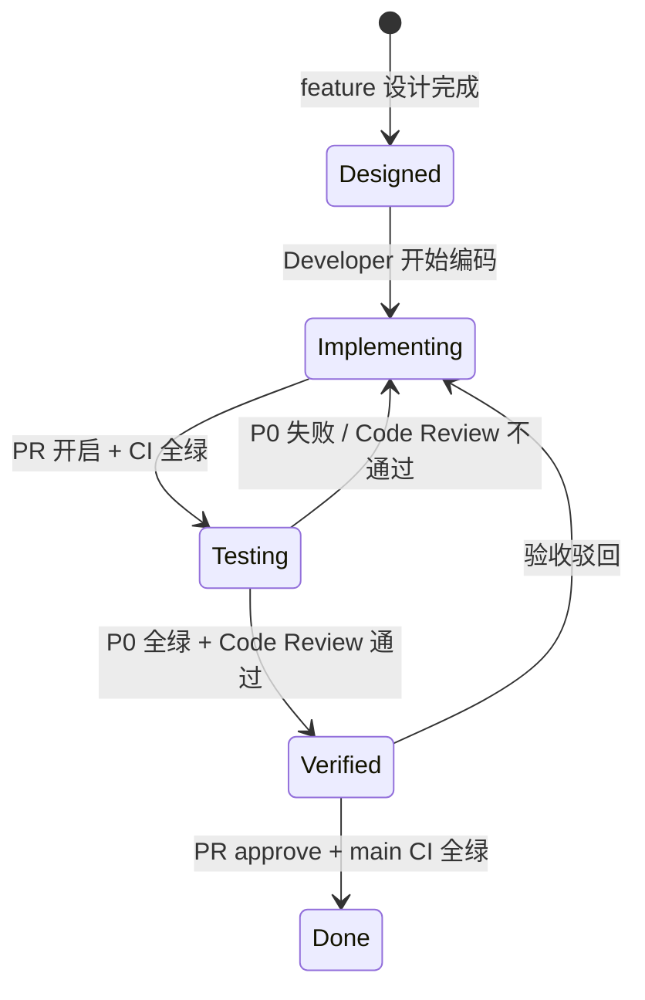

# Feature 开发流程

## 通信模型

所有 sub-agent 间不直接通信，通过 **Orchestrator 中转** 与 **共享文件** 传递信息。

**共享文件**：

| 文件 | 用途 |
|------|------|
| `.last-action-summary.md` | sub-agent 完成信号与结果汇报 |
| `state.md` | 状态流转与阻塞记录 |
| `feature.md` / `design.md` | 设计文档 |
| `test-plan.md` / `test-report.md` | 测试用例与结果 |
| GitHub PR / Issue | 代码评审与缺陷报告 |

**共享文件读写规则**：

| 文件 / 字段 | 写入者 | 读取者 |
|------------|--------|--------|
| `state.md` `current` | Orchestrator | 所有 sub-agent |
| `state.md` `history` | Designer / Developer / Tester | Orchestrator |
| `state.md` `blockers` | Designer / Developer / Tester | Orchestrator |
| `state.md` `test_status.*` | Tester | Orchestrator |
| `state.md` `ci_status.pr_checks` | Developer | Orchestrator / Tester |
| `state.md` `ci_status.main_checks` | Tester | Orchestrator |
| `.last-action-summary.md` (feature 级) | Designer | Orchestrator |
| `.last-action-summary.md` (US 级) | Developer / Tester / Reviewer | Orchestrator |
| `feature.md` / `design.md` | Designer | Developer / Tester / Reviewer |
| `test-plan.md` / `test-report.md` | Tester | Orchestrator / Developer |

## 协作时序

```mermaid
sequenceDiagram
  autonumber
  participant U as 用户
  participant O as Orchestrator
  participant DS as Designer
  participant D as Developer
  participant T as Tester
  participant R as Reviewer

  U->>O: 推进 ft-XXX
  O->>DS: 唤起 Designer
  DS->>DS: 功能设计 [feature-design]
  opt 命中交互设计触发条件
    DS->>DS: 交互设计 [storybook-authoring]
  end
  DS->>R: 提交设计评审 [design-review]
  R-->>DS: 评审结果

  DS-->>O: 设计完成
  O->>U: 设计方案审批 [Gate]
  opt 命中交互设计触发条件
    U->>U: 交互原型评审（浏览器操作 Storybook）
  end
  alt 通过
    U-->>O: approve
    O->>O: 更新 state → Designed
  else 驳回
    O->>DS: 反馈修改
  end

  O->>O: 选择可推进的 US
  par 测试设计阶段
    O->>T: 唤起 Tester
    T->>T: 测试设计 [test-design-rubric]
  and 开发阶段
    O->>D: 唤起 Developer
    D->>D: 编码实现 [engineering]
    D->>D: PR 流程 [feature-pr-flow]
  end

  D->>R: 请求代码评审 [code-review]
  R-->>D: 评审结果

  D-->>O: 开发完成
  O->>T: 触发测试执行 [test-execution]
  T->>T: P0 门禁
  T-->>O: P0 通过
  O->>U: 提交验收 [Gate]
  O->>T: 继续 P1/P2

  alt 验收通过
    U-->>O: approve
    O->>O: 更新 state → Done
    O->>T: 收尾仪式
  else 验收驳回
    O->>D: 反馈问题
    D->>D: 修复 → 重新提测
  end
```

## 状态模型

### Feature 级状态机

```mermaid
stateDiagram-v2
  [*] --> Draft : 创建 Feature
  Draft --> Designed : 设计方案审批通过
  Designed --> [*] : US 子目录创建完成
```

### US 级状态机

```mermaid
stateDiagram-v2
  [*] --> Designed : feature 设计完成
  Designed --> Implementing : Developer 开始编码
  Implementing --> Testing : PR 开启 + CI 全绿
  Testing --> Verified : P0 全绿 + Code Review 通过
  Verified --> Done : PR approve + main CI 全绿

  Testing --> Implementing : P0 失败 / Code Review 不通过
  Verified --> Implementing : 验收驳回
```

**Feature 完成条件**：所有 US 均达到 `Done`。

## Gate 模型

| Gate | 触发时机 | 通过条件 |
|------|---------|---------|
| 设计方案审批 | Designer 提交设计产出 | 用户 approve |
| 用户验收 | P0 全绿 + Code Review 通过 + CI 全绿 | PR approve |

**架构信号**（设计方案审批时一并审查）：OpenAPI 变更、data-model 变更、CI/CD 变更、新增外部依赖、跨越系统边界。

**交互信号**（条件触发）：新增页面、引入新可复用组件、复杂交互（拖拽、复合表单等）时，Designer 阶段产出 Storybook 原型，用户在设计方案审批 Gate 之前完成交互原型评审。

## 阶段-Skill 映射

| 时序图阶段 | 执行 Agent | Skill | 关键产出 | Gate |
|-----------|-----------|-------|---------|------|
| 功能设计 | Designer | `feature-design` | feature.md, design.md | — |
| 交互设计 | Designer | `storybook-authoring` | Storybook 原型, data-testid 清单, 交互约束 | 条件触发 |
| 设计评审 | Reviewer | `design-review` | 架构评审意见 | — |
| 测试设计阶段 | Tester | `test-design-rubric` | test-plan.md, E2E 代码 (*.spec.ts) | — |
| 开发阶段 | Developer | `engineering` | 代码 + 单元测试 | — |
| PR 流程 | Developer | `feature-pr-flow` | PR | — |
| 代码评审 | Reviewer | `code-review` | 评审意见 | — |
| 测试执行 | Tester | `test-execution` | test-report.md | P0 门禁 |
| 收尾仪式 | Tester | — | test-registry 更新 | 用户验收 |

## 编排规则

用户说「推进 ft-XXX」时，Orchestrator 读取 feature/state.md，若为 `Designed` 则扫描所有 us-*/state.md，按优先级选择可推进的 US 并唤起对应 Agent。完整执行规则见 `.claude/agents/prompts/orchestrator.md`。
