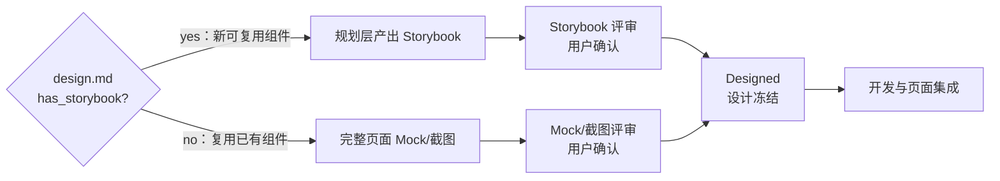

# Storybook 使用指南

> **本文档现为薄壳**。Storybook 编写规范（文件位置、Story 模板、必写 stories、Mock 数据、评审展示模板）是 agent 实际加载的事实源，位于 Skill `storybook-authoring`（[`.claude/skills/storybook-authoring/SKILL.md`](../../.claude/skills/storybook-authoring/SKILL.md)）。
>
> 本文件保留作为人类入口锚点（Product-Backlog / process/README.md 已链）。

## 何时需要 Storybook

`design.md` 必须二选一声明 `has_storybook`（TD-016）：

- `has_storybook: yes` — 本 feature 引入**新可复用组件**，规划阶段产出 stories，Plan 批准时用户审过
- `has_storybook: no` — 仅复用已有组件 / 纯页面拼装；交互确认改走完整页面 Mock / 截图

详细政策与决策表见 [`docs/process/common.md`](./common.md)。

## CDD 流程位置

## 编写规范

完整规范看 Skill：文件位置（CDD 5 层）、Story 结构模板、必写 stories（Default / Filled / Loading / WithErrors / Empty / Mobile）、Mock 数据来源约束、Plan mode 评审展示模板、典型反模式（TD-016 空转）。

如要修改规范——**先改 Skill，再让本文档跟随**。

## 与测试的边界

| 类型 | 关注 | 时机 |
|------|------|------|
| Storybook | 视觉 + 组件级交互 | 开发前的设计评审 |
| Unit Test | 逻辑、边界 | 提交前 |
| E2E | 完整用户旅程 | 集成阶段（详见 Skill `e2e-playwright`） |

## 现有示例

> 待 feature 开发后补充实际 Storybook 示例路径。
