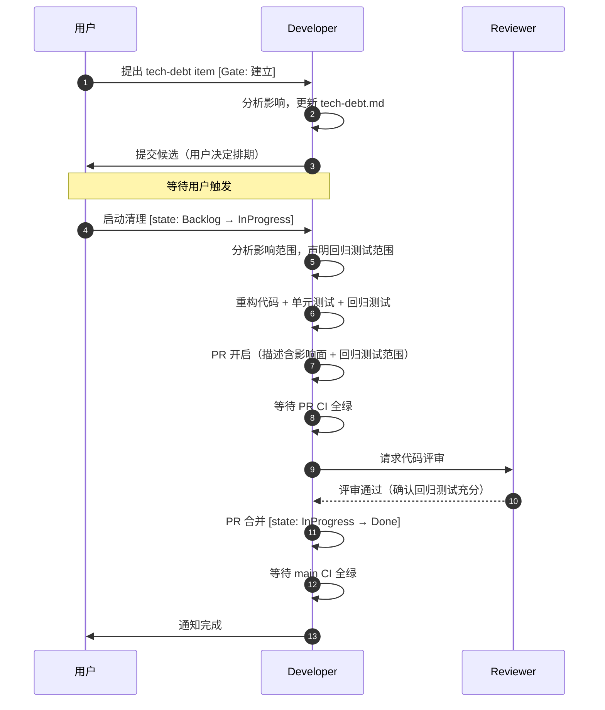
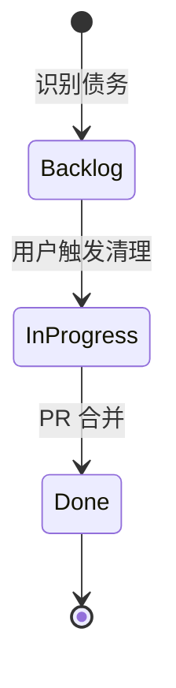

# Tech Debt 清理流程

## 1.1 协作时序

## 1.2 状态机

## 1.3 Gate

| Gate | 触发时机 | 状态影响 | 说明 |
|------|---------|---------|------|
| **建立** | Tech Debt 登记，提供影响面和修复成本评估 | — | 用户确认是否纳入 Backlog |
| **关闭** | PR 合并后 | `InProgress → Done` | 用户确认完成（可选，可自动化） |

Tech Debt 清理不需要设计方案审批，直接走 PR 流程。

## 1.4 检测规则

Tester 在 Done 收尾仪式扫描以下信号，登记新债务到 GitHub Issues：

**代码层面**

- `TODO` / `FIXME` / `HACK` / `XXX` 注释
- 过长函数（> 100 行）或文件（> 500 行）
- 重复代码（可抽取为公共函数）
- 硬编码的配置值

**架构层面**

- OpenAPI 与实现不一致
- Schema 约束缺失或不一致
- 错误处理不统一

**测试层面**

- 覆盖率低于 70% 的模块
- 长期存在的 FAILED 集成测试
