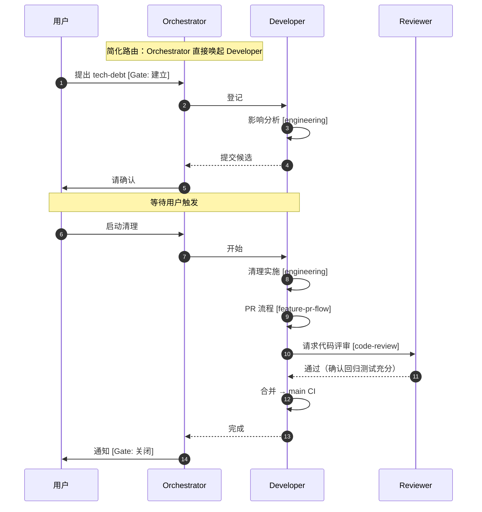
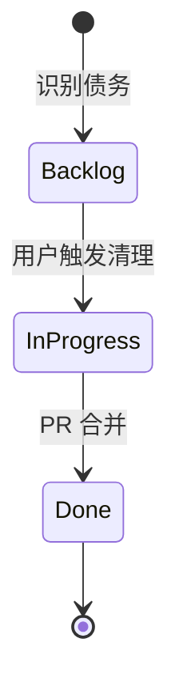

# Tech Debt 清理流程

## 协作时序

```mermaid
sequenceDiagram
  autonumber
  participant U as 用户
  participant O as Orchestrator
  participant D as Developer
  participant R as Reviewer

  Note over O: 简化路由：Orchestrator 直接唤起 Developer

  U->>O: 提出 tech-debt [Gate: 建立]
  O->>D: 登记
  D->>D: 影响分析 [engineering]
  D-->>O: 提交候选
  O->>U: 请确认

  Note over U,D: 等待用户触发

  U->>O: 启动清理
  O->>D: 开始
  D->>D: 清理实施 [engineering]
  D->>D: PR 流程 [feature-pr-flow]
  D->>R: 请求代码评审 [code-review]
  R-->>D: 通过（确认回归测试充分）
  D->>D: 合并 → main CI
  D-->>O: 完成
  O->>U: 通知 [Gate: 关闭]
```

## 状态机

```mermaid
stateDiagram-v2
  [*] --> Backlog : 识别债务
  Backlog --> InProgress : 用户触发清理
  InProgress --> Done : PR 合并
  Done --> [*]
```

## Gate 模型

| Gate | 触发时机 | 说明 |
|------|---------|------|
| 建立 | Tech Debt 登记 | 用户提供影响面和修复成本评估 |
| 关闭 | PR 合并后 | 用户确认完成（可自动化） |

Tech Debt 清理不需要设计方案审批，直接走 PR 流程。

## 阶段-Skill 映射

| 阶段 | 执行 Agent | Skill | 说明 |
|------|-----------|-------|------|
| 影响分析 | Developer | `engineering` | 分析影响范围，声明回归测试 |
| 清理实施 | Developer | `engineering` | 重构 + 单元测试 + 回归测试 |
| 代码评审 | Reviewer | `code-review` | 确认回归测试充分 |
| 债务检测 | Tester | — | Done 后扫描新债务（见下方检测规则） |

## 检测规则

Tester 在 Done 收尾仪式扫描以下信号，登记新债务到 GitHub Issues：

**代码层面**

- `TODO` / `FIXME` / `HACK` / `XXX` 注释
- 过长函数（> 100 行）或文件（> 500 行）
- 重复代码（可抽取为公共函数）
- 硬编码的配置值

**架构层面**

- OpenAPI 与实现不一致
- Schema 约束缺失或不一致
- 错误处理不统一

**测试层面**

- 覆盖率低于 70% 的模块
- 长期存在的 FAILED 集成测试
